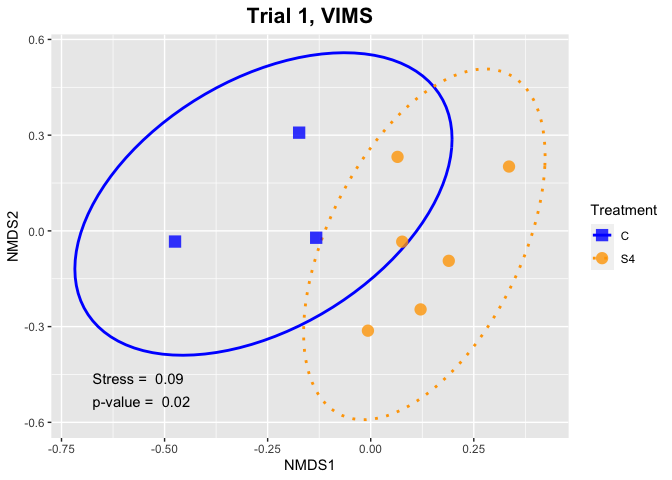
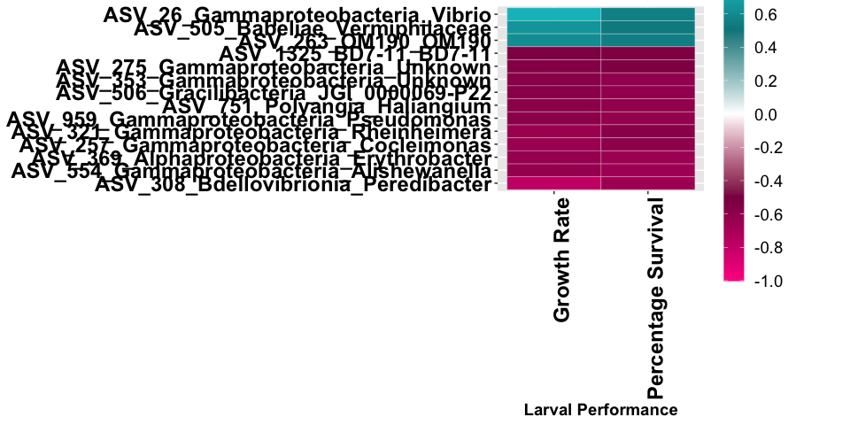
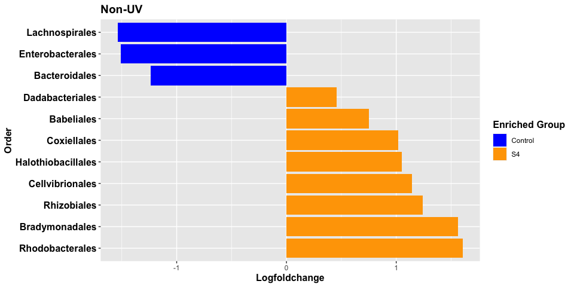

# Setup

## Load packages


```r
library(readxl)
library(openxlsx)
library(vegan)
```

```
## Loading required package: permute
```

```
## Loading required package: lattice
```

```
## This is vegan 2.6-4
```

```r
library(tidyverse)
```

```
## ── Attaching core tidyverse packages ──────────────────────── tidyverse 2.0.0 ──
## ✔ dplyr     1.1.0     ✔ readr     2.1.4
## ✔ forcats   1.0.0     ✔ stringr   1.5.0
## ✔ ggplot2   3.4.1     ✔ tibble    3.1.8
## ✔ lubridate 1.9.2     ✔ tidyr     1.3.0
## ✔ purrr     1.0.1
```

```
## ── Conflicts ────────────────────────────────────────── tidyverse_conflicts() ──
## ✖ dplyr::filter() masks stats::filter()
## ✖ dplyr::lag()    masks stats::lag()
## ℹ Use the conflicted package (<http://conflicted.r-lib.org/>) to force all conflicts to become errors
```

```r
library(phyloseq)
library(gridExtra)
```

```
## 
## Attaching package: 'gridExtra'
## 
## The following object is masked from 'package:dplyr':
## 
##     combine
```

```r
library(grid)
library(ggpubr)
library(agricolae)
```

```
## Registered S3 methods overwritten by 'klaR':
##   method      from 
##   predict.rda vegan
##   print.rda   vegan
##   plot.rda    vegan
```

```r
library(microbiome)
```

```
## 
## microbiome R package (microbiome.github.com)
##     
## 
## 
##  Copyright (C) 2011-2021 Leo Lahti, 
##     Sudarshan Shetty et al. <microbiome.github.io>
## 
## 
## Attaching package: 'microbiome'
## 
## The following object is masked from 'package:ggplot2':
## 
##     alpha
## 
## The following object is masked from 'package:vegan':
## 
##     diversity
## 
## The following object is masked from 'package:base':
## 
##     transform
```

```r
library(devtools)
```

```
## Loading required package: usethis
## 
## Attaching package: 'devtools'
## 
## The following object is masked from 'package:permute':
## 
##     check
```

```r
library(ggh4x) # devtools::install_github("teunbrand/ggh4x")
library(patchwork)
library(lme4)
```

```
## Loading required package: Matrix
## 
## Attaching package: 'Matrix'
## 
## The following objects are masked from 'package:tidyr':
## 
##     expand, pack, unpack
```

```r
library(car)
```

```
## Loading required package: carData
## 
## Attaching package: 'car'
## 
## The following object is masked from 'package:dplyr':
## 
##     recode
## 
## The following object is masked from 'package:purrr':
## 
##     some
```

```r
library(emmeans)
```

```
## 
## Attaching package: 'emmeans'
## 
## The following object is masked from 'package:devtools':
## 
##     test
```

```r
set.seed(121)

# set global options for code output
knitr::opts_chunk$set(echo=TRUE, warning=FALSE)
```

## Load the data


```r
## Count table
abund_table <- read.xlsx("Data.xlsx", sheet="table", rowNames = TRUE)

## Metadata table
meta_table <-read.xlsx("Data.xlsx", sheet="meta_table", rowNames = TRUE)

## Taxonomy table
taxa_table <- read_excel("Data.xlsx", sheet = "taxonomy") %>% 
   separate(Taxon, sep="; ", c("Kingdom", "Phylum", "Class", "Order", "Family", "Genus", "Species")) %>% 
   select(-c(Confidence)) %>% 
   column_to_rownames("FeatureID")
taxa_table[is.na(taxa_table)] <- 'Unknown'
```

## Format data as physeq


```r
## abundance table
count_tab_phy <- otu_table(as.matrix(abund_table), taxa_are_rows=T)

# taxonomy 
tax_tab_phy <- tax_table(as.matrix(taxa_table))

## metadata
sample_info_tab_phy <- sample_data(meta_table)

## make phyloseq object
All_S4 <-phyloseq(count_tab_phy, tax_tab_phy, sample_info_tab_phy)

##Check if there are ASV's with 0 counts, number and remove them
All_S4_prune <- prune_taxa(taxa_sums(All_S4) > 0, All_S4)
any(taxa_sums(All_S4_prune) == 0)
```

```
## [1] FALSE
```

```r
##Remove any taxa associated with chloroplast and mitochondria
justbacteria <- All_S4_prune %>%
  subset_taxa(Kingdom == "d__Bacteria" & Phylum  != "p__Cyanobacteria" & Family != "f__Mitochondria")
```

## Reorder metadata factors


```r
# Reorder Trials
sample_data(justbacteria)$Trial <- factor(sample_data(justbacteria)$Trial, levels = c("T1","T2","T3","T4","T5","T6","T7","T8"))
levels(sample_data(justbacteria)$Trial)
```

```
## [1] "T1" "T2" "T3" "T4" "T5" "T6" "T7" "T8"
```

```r
# Relabel the Trial
sample_data(justbacteria)$Name <- factor(sample_data(justbacteria)$Name, labels = c("T1","T2","T3","T4","T5","T6","T7","T8_NUV","T8_UV"))
levels(sample_data(justbacteria)$Name)
```

```
## [1] "T1"     "T2"     "T3"     "T4"     "T5"     "T6"     "T7"     "T8_NUV"
## [9] "T8_UV"
```

```r
# Reorder Hatchery labels
sample_data(justbacteria)$Hatchery <- factor(sample_data(justbacteria)$Hatchery, levels = c("VIMS", "Mat", "MK", "RWU"))
levels(sample_data(justbacteria)$Hatchery)
```

```
## [1] "VIMS" "Mat"  "MK"   "RWU"
```


## Rarefy the data


```r
#Delete samples less than 12000 reads
justbacteria_12000 <- subset_samples(justbacteria, sample_sums(justbacteria) > 12000)

# check size of smallest sample
min(sample_sums(justbacteria_12000))
```

```
## [1] 12640
```

```r
# Rarefy to 12640 reads
justbacteria_12000_rarefy <- rarefy_even_depth(justbacteria, rngseed= 81, sample.size = min(sample_sums(justbacteria_12000)))
```

```
## `set.seed(81)` was used to initialize repeatable random subsampling.
```

```
## Please record this for your records so others can reproduce.
```

```
## Try `set.seed(81); .Random.seed` for the full vector
```

```
## ...
```

```
## 4 samples removedbecause they contained fewer reads than `sample.size`.
```

```
## Up to first five removed samples are:
```

```
## ET234_S17ET239_S77ET317_S123RS329_S68
```

```
## ...
```

```
## 457OTUs were removed because they are no longer 
## present in any sample after random subsampling
```

```
## ...
```

```r
# check the total number of ASVs
length(taxa_sums(justbacteria_12000_rarefy))
```

```
## [1] 2499
```

```r
## Rearrange the Metatable
SD <- sample_data(justbacteria_12000_rarefy) %>%
    data.frame() %>%
    select("Treatment","Trial", "Num","Tank_Replicate","Hatchery","Location", "Condition", "Num") %>% 
    rownames_to_column("SampleID")

# remove technical replicates from meta table
All_Meta <- SD %>% distinct(Num,Treatment,Trial,Hatchery, Location, Tank_Replicate, Condition) %>% 
   remove_rownames %>% column_to_rownames(var="Num")
```


# Figure 1 - Order barplot


```r
my_colors <- c("#CBD588", "#5F7FC7", "orange","#DA5724", "#508578", "#CD9BCD", "#AD6F3B", "#673770","#D14285", "#652926", "#C84248", "#8569D5", "grey60","#D1A33D")

Order_abundances <- justbacteria_12000_rarefy %>% tax_glom(taxrank = "Order") %>% 
   psmelt() %>% 
   # calculate mean of the technical replicates per order
   group_by(Num,Treatment,Name,Hatchery,Order) %>% 
   summarise(mean_abun=mean(Abundance/12640*100)) %>% ungroup() %>% 
   # make new column of cleaned top 12 Orders
   mutate(OrderClean=str_remove(Order, "o__"),
          # select the 12 most abundant orders, then group all the Others
          OrderOther=forcats::fct_lump_n(f=OrderClean, w=mean_abun, other_level="Others", n=12)) %>% 
   # calculate sums for Other
   group_by(Num,Treatment,Name,Hatchery,OrderOther) %>% 
   summarise(sum_abun=sum(mean_abun)) %>% ungroup() %>% 
   # reorder OrderOther
   mutate(OrderOther = reorder(OrderOther, -sum_abun),
          OrderOther = fct_relevel(OrderOther, "Others", after = Inf))
```

```
## `summarise()` has grouped output by 'Num', 'Treatment', 'Name', 'Hatchery'. You
## can override using the `.groups` argument.
## `summarise()` has grouped output by 'Num', 'Treatment', 'Name', 'Hatchery'. You
## can override using the `.groups` argument.
```

```r
  Order_abundances
```

```
## # A tibble: 741 × 6
##      Num Treatment Name  Hatchery OrderOther                          sum_abun
##    <dbl> <chr>     <fct> <fct>    <fct>                                  <dbl>
##  1     1 C         T1    VIMS     Alteromonadales                      12.6   
##  2     1 C         T1    VIMS     Bacillales                           29.6   
##  3     1 C         T1    VIMS     Cellvibrionales                       0.161 
##  4     1 C         T1    VIMS     Enterobacterales                      0.0211
##  5     1 C         T1    VIMS     Flavobacteriales                      0.311 
##  6     1 C         T1    VIMS     Nannocystales                         0.214 
##  7     1 C         T1    VIMS     Nitrosococcales                       0.0316
##  8     1 C         T1    VIMS     Oceanospirillales                     1.05  
##  9     1 C         T1    VIMS     Peptostreptococcales-Tissierellales   0     
## 10     1 C         T1    VIMS     Pseudomonadales                      27.4   
## # … with 731 more rows
```

```r
  write.csv( Order_abundances, "Tables/order.csv")
   
   # start plotting
Order_abundances %>% ggplot() +
   geom_col(aes(x = Num, y = sum_abun, fill = OrderOther), position="fill")+
   labs(y="Percent Order Abundance", x=NULL, fill="Order") +
   facet_nested(.~Hatchery+Name+Treatment, scales = "free", space="free", switch="x") +
   scale_fill_manual(values = my_colors) +
   scale_y_continuous(expand = c(0,0),labels=scales::percent)+
   theme_minimal()+
   theme(axis.text.x = element_blank(), panel.spacing = unit(0.2,"lines"),
         panel.grid.major.x = element_blank(), panel.grid.minor.x = element_blank(),
         strip.background = element_rect(fill="gray85"),
         axis.text.y.left = element_text(size=16, face="bold"),
         axis.title.y = element_text(size = 18, face="bold"),
         strip.text.x = element_text(size = 18,face="bold"),
         legend.position="bottom", legend.title = element_text(size=20, face="bold"), 
         legend.text = element_text(size=18, face="bold"))
```

<!-- -->

```r
ggsave("Figures/Figure1.png", width=18, height=8, dpi=400)
```


# Figure 2 - Simpsons diversity


```r
# subset samples to remove Trial 5 and trial6
phy <- subset_samples(justbacteria_12000_rarefy, Trial %in% c("T1","T2","T3","T4","T7","T8"))

# get metadata
SD <- sample_data(phy) %>% data.frame() %>%
   select("Treatment","Trial","Num","Tank_Replicate") %>% 
   rownames_to_column("SampleID")

# calculate diversity
adiv <- data.frame(
   "Simpson" = phyloseq::estimate_richness(phy, measures = "Simpson"),
   "Chao1"= phyloseq::estimate_richness(phy, measures = "Chao1"),
   "Status" = phyloseq::sample_data(phy)$Treatment) %>% 
   rownames_to_column("SampleID") %>% 
   # add in the metadata
   left_join(SD)
```

```
## Joining with `by = join_by(SampleID)`
```

```r
# calculate diversity per tank from technical replicates
Div <- adiv %>% group_by(Num,Trial,Treatment,Tank_Replicate) %>% summarise(mean_div=mean(Simpson), sd_div=sd(Simpson))
```

```
## `summarise()` has grouped output by 'Num', 'Trial', 'Treatment'. You can
## override using the `.groups` argument.
```

```r
Div <- as.data.frame(Div)
Div
```

```
##    Num Trial Treatment Tank_Replicate  mean_div      sd_div
## 1    1    T1         C              A 0.7610813 0.212122465
## 2    2    T1         C              B 0.9207979 0.012105111
## 3    3    T1         C              C 0.9170490 0.010536555
## 4    4    T1        S4              A 0.8681257 0.015594495
## 5    5    T1        S4              B 0.8193521 0.036376329
## 6    6    T1        S4              C 0.9062147 0.014065648
## 7    7    T1        S4              D 0.9270788 0.004992062
## 8    8    T1        S4              E 0.8671763 0.070222245
## 9    9    T1        S4              F 0.9248127 0.002468725
## 10  10    T2         C              A 0.9382824 0.003472532
## 11  11    T2         C              B 0.8890229 0.013336114
## 12  12    T2         C              C 0.9265251 0.004676416
## 13  13    T2        S4              A 0.9384931 0.007597512
## 14  14    T2        S4              B 0.8842156 0.093185742
## 15  15    T2        S4              C 0.9267378 0.001130194
## 16  16    T3         C              A 0.9211905 0.026647682
## 17  17    T3         C              B 0.9243698 0.028507238
## 18  18    T3         C              C 0.9158333 0.043185308
## 19  19    T3         C              D 0.9545962 0.009148219
## 20  20    T3        S4              A 0.9392980 0.009757227
## 21  21    T3        S4              B 0.9563944 0.012478301
## 22  22    T3        S4              C 0.9442511 0.012630210
## 23  23    T3        S4              D 0.9481416 0.011775010
## 24  24    T4         C              A 0.8718640 0.021764430
## 25  25    T4         C              B 0.8825644 0.016879112
## 26  26    T4         C              C 0.9543203 0.008612057
## 27  27    T4         C              D 0.9008634 0.052682539
## 28  28    T4        S4              A 0.9267550 0.008892059
## 29  29    T4        S4              B 0.9043664 0.014563959
## 30  30    T4        S4              C 0.9275796 0.011354678
## 31  31    T4        S4              D 0.9483954 0.005391934
## 32  45    T7         C              A 0.9292842 0.004157082
## 33  46    T7         C              B 0.9534610 0.003608174
## 34  47    T7         C              C 0.9500981 0.010982446
## 35  48    T7         C              D 0.9564731 0.005419549
## 36  49    T7        S4              A 0.9367671 0.005233261
## 37  50    T7        S4              B 0.9279730 0.013313302
## 38  51    T7        S4              C 0.9251214 0.006903375
## 39  52    T7        S4              D 0.9338252 0.010727566
## 40  54    T8         C              A 0.9167362 0.068176480
## 41  55    T8         C              B 0.8829939 0.028086545
## 42  56    T8         C              C 0.9272076 0.026569798
## 43  57    T8        S4              A 0.8763590 0.024120932
## 44  58    T8        S4              B 0.9051230 0.026607367
## 45  59    T8        S4              C 0.9317192 0.011526675
## 46  60    T8         C              A 0.8158331 0.076843342
## 47  61    T8         C              B 0.8015379 0.051728096
## 48  62    T8         C              C 0.8305522 0.013744054
## 49  63    T8        S4              A 0.8364309 0.062471264
## 50  64    T8        S4              B 0.8772720 0.042609279
## 51  65    T8        S4              C 0.8915646 0.033539437
```

```r
# plotting
Div_SIM <- ggplot(Div, aes(x=Treatment, y=mean_div, fill=Treatment))+
   geom_boxplot(alpha=0.7)+
   geom_jitter(aes(shape=Treatment), width=0.2)+
   scale_fill_manual(values=c("blue", "orange"))+
   scale_shape_manual(values=c(22,21))+
   facet_grid(.~Trial, scales="free",space="free_x",switch="y")+
   theme_gray()+
   labs(y="Simpson's Diversity", x="Treatment", fill="Treatment")+theme_bw()+
   theme(strip.text.x = element_text(size=12,face="bold"),
         panel.grid.major.x = element_blank(),
         strip.background = element_rect(fill="gray85"),
         axis.text.y = element_text(size="14", color="black"), 
         axis.title.y = element_text(face="bold",size="14", color="black"),
         axis.text.x = element_text(size="12", color="black", angle = 0), 
         axis.title.x.bottom = element_text(face="bold",size="14", color="black"),
         axis.text.x.top= element_text(face="bold",size="14", color="black"),
         legend.position = "None",panel.spacing = unit(0.2, "mm"),               
         panel.border = element_rect(colour="grey"))+
   scale_y_continuous(limits=c(0.6, 1))
Div_SIM 
```

<!-- -->

```r
ggsave(filename = "Figures/Figure2.png", width=7, height=4, dpi = 400)
```

## Stats


```r
Avg_Simp <- adiv %>% group_by(Num,Trial,Treatment,Tank_Replicate) %>% summarise(mean_Simpsons=mean(Simpson), sd_Simpsons=sd(Simpson))
```

```
## `summarise()` has grouped output by 'Num', 'Trial', 'Treatment'. You can
## override using the `.groups` argument.
```

```r
Avg_Chao1 <- adiv %>% group_by(Num,Trial,Treatment,Tank_Replicate) %>% summarise(mean_Chao1=mean(Chao1.Chao1), sd_Chao1=sd(Chao1.Chao1))
```

```
## `summarise()` has grouped output by 'Num', 'Trial', 'Treatment'. You can
## override using the `.groups` argument.
```

```r
Average <- full_join(Avg_Chao1, Avg_Simp)
```

```
## Joining with `by = join_by(Num, Trial, Treatment, Tank_Replicate)`
```

```r
write.csv(Average, "Tables/diversity.csv")
##Simpson's diversity
Simpson_Anova <- aov(mean_Simpsons ~ Treatment*Trial, data=Average)
summary(Simpson_Anova)
```

```
##                 Df  Sum Sq  Mean Sq F value   Pr(>F)    
## Treatment        1 0.00110 0.001104   0.791 0.379370    
## Trial            5 0.03771 0.007542   5.400 0.000723 ***
## Treatment:Trial  5 0.00279 0.000557   0.399 0.846484    
## Residuals       39 0.05446 0.001397                     
## ---
## Signif. codes:  0 '***' 0.001 '**' 0.01 '*' 0.05 '.' 0.1 ' ' 1
```

```r
tukey_Simp <- HSD.test(Simpson_Anova, "Trial", group = FALSE)
tukey_Simp$comparison
```

```
##           difference pvalue signif.         LCL          UCL
## T1 - T2 -0.038136331 0.3964         -0.09714445  0.020871785
## T1 - T3 -0.058932874 0.0271       * -0.11333567 -0.004530080
## T1 - T4 -0.035512079 0.3854         -0.08991487  0.018890715
## T1 - T7 -0.060048886 0.0231       * -0.11445168 -0.005646092
## T1 - T8  0.004632379 0.9997         -0.04473735  0.054002110
## T2 - T3 -0.020796543 0.9048         -0.08126187  0.039668782
## T2 - T4  0.002624252 1.0000         -0.05784107  0.063089577
## T2 - T7 -0.021912555 0.8841         -0.08237788  0.038552770
## T2 - T8  0.042768709 0.2230         -0.01321130  0.098748723
## T3 - T4  0.023420795 0.8077         -0.03255922  0.079400808
## T3 - T7 -0.001116012 1.0000         -0.05709603  0.054864001
## T3 - T8  0.063565252 0.0075      **  0.01246273  0.114667779
## T4 - T7 -0.024536807 0.7761         -0.08051682  0.031443206
## T4 - T8  0.040144457 0.1980         -0.01095807  0.091246984
## T7 - T8  0.064681265 0.0063      **  0.01357874  0.115783791
```

```r
##Chao1 richness
Chao1_Anova <- aov(mean_Chao1 ~ Treatment*Trial, data=Average)
summary(Chao1_Anova)
```

```
##                 Df Sum Sq Mean Sq F value   Pr(>F)    
## Treatment        1    319     319   0.487    0.489    
## Trial            5  88235   17647  26.990 1.08e-11 ***
## Treatment:Trial  5   6364    1273   1.947    0.109    
## Residuals       39  25500     654                     
## ---
## Signif. codes:  0 '***' 0.001 '**' 0.01 '*' 0.05 '.' 0.1 ' ' 1
```

```r
tukey_Chao1 <- HSD.test(Chao1_Anova, "Trial", group = FALSE)
tukey_Chao1$comparison
```

```
##         difference pvalue signif.         LCL        UCL
## T1 - T2 -42.852464 0.0319       *  -83.228519  -2.476408
## T1 - T3 -97.455250 0.0000     *** -134.680134 -60.230366
## T1 - T4 -62.092294 0.0002     ***  -99.317178 -24.867410
## T1 - T7 -82.413510 0.0000     *** -119.638394 -45.188625
## T1 - T8   8.475557 0.9738          -25.305475  42.256589
## T2 - T3 -54.602786 0.0040      **  -95.975932 -13.229641
## T2 - T4 -19.239830 0.7307          -60.612976  22.133315
## T2 - T7 -39.561046 0.0680       .  -80.934192   1.812100
## T2 - T8  51.328021 0.0033      **   13.023931  89.632110
## T3 - T4  35.362956 0.0849       .   -2.941134  73.667046
## T3 - T7  15.041740 0.8452          -23.262350  53.345830
## T3 - T8 105.930807 0.0000     ***   70.964117 140.897497
## T4 - T7 -20.321216 0.6101          -58.625306  17.982874
## T4 - T8  70.567851 0.0000     ***   35.601161 105.534541
## T7 - T8  90.889067 0.0000     ***   55.922376 125.855757
```

# Figure 3 - NMDS plots


```r
#Generate ellipse points 
veganCovEllipse<-function (cov, center = c(0, 0), scale = 1, npoints = 100) 
{
  theta <- (0:npoints) * 2 * pi/npoints
  Circle <- cbind(cos(theta), sin(theta))
  t(center + scale * t(Circle %*% chol(cov)))
}
```

## Trial 1


```r
ASV_t1 <- subset_samples(justbacteria_12000_rarefy, Trial=="T1") %>% psmelt() %>%
   group_by(Num,OTU) %>% summarise(avg_abundance = mean(Abundance)) %>%  # average by tank
   spread(Num,avg_abundance)  %>% remove_rownames %>% column_to_rownames(var="OTU") %>%  t() %>% as.data.frame()
```

```
## `summarise()` has grouped output by 'Num'. You can override using the `.groups`
## argument.
```

```r
Meta_t1 <- All_Meta %>% filter(Trial=="T1")

sol_t1 <-metaMDS(ASV_t1 ,distance = "bray", k = 2, trymax = 50)
```

```
## Square root transformation
## Wisconsin double standardization
## Run 0 stress 0.08643075 
## Run 1 stress 0.1386525 
## Run 2 stress 0.1268231 
## Run 3 stress 0.1600886 
## Run 4 stress 0.1268231 
## Run 5 stress 0.1600886 
## Run 6 stress 0.1268231 
## Run 7 stress 0.08643076 
## ... Procrustes: rmse 2.884714e-05  max resid 4.822657e-05 
## ... Similar to previous best
## Run 8 stress 0.1268231 
## Run 9 stress 0.08643075 
## ... New best solution
## ... Procrustes: rmse 5.530486e-06  max resid 9.720284e-06 
## ... Similar to previous best
## Run 10 stress 0.1268231 
## Run 11 stress 0.08643075 
## ... Procrustes: rmse 9.658589e-07  max resid 1.729892e-06 
## ... Similar to previous best
## Run 12 stress 0.08643077 
## ... Procrustes: rmse 6.982854e-05  max resid 0.0001248361 
## ... Similar to previous best
## Run 13 stress 0.08643076 
## ... Procrustes: rmse 5.361674e-05  max resid 9.716587e-05 
## ... Similar to previous best
## Run 14 stress 0.1268231 
## Run 15 stress 0.1268231 
## Run 16 stress 0.1386525 
## Run 17 stress 0.2060447 
## Run 18 stress 0.1600508 
## Run 19 stress 0.2279268 
## Run 20 stress 0.08643075 
## ... Procrustes: rmse 1.976794e-06  max resid 3.514027e-06 
## ... Similar to previous best
## *** Best solution repeated 5 times
```

```r
NMDS_t1=data.frame(NMDS1=sol_t1$point[,1], NMDS2=sol_t1$point[,2], Treatment=as.factor(Meta_t1[,1]))

plot.new()
ord_t1<-ordiellipse(sol_t1, as.factor(Meta_t1$Treatment), display = "sites", kind ="sd", conf = 0.95, label = T)
```

<!-- -->

```r
#dev.off()

df_ell_t1 <- data.frame()
for(g in levels(NMDS_t1$Treatment)){
   if(g!="" && (g %in% names(ord_t1))){
      df_ell_t1 <- rbind(df_ell_t1, cbind(as.data.frame(with(NMDS_t1[NMDS_t1$Treatment==g,],                            veganCovEllipse(ord_t1[[g]]$cov,ord_t1[[g]]$center,ord_t1[[g]]$scale))),Treatment=g))}}

#Calculate permanova p-value:
adon_t1<-adonis2(ASV_t1 ~Treatment, data=Meta_t1, by=NULL,method="bray", k=2)
adon_t1
```

```
## Permutation test for adonis under reduced model
## Permutation: free
## Number of permutations: 999
## 
## adonis2(formula = ASV_t1 ~ Treatment, data = Meta_t1, method = "bray", by = NULL, k = 2)
##          Df SumOfSqs      R2      F Pr(>F)  
## Model     1  0.37275 0.23753 2.1806  0.022 *
## Residual  7  1.19654 0.76247                
## Total     8  1.56929 1.00000                
## ---
## Signif. codes:  0 '***' 0.001 '**' 0.01 '*' 0.05 '.' 0.1 ' ' 1
```

```r
# calculate beta-dispersion p-value:
disper_t1 <- betadisper(vegdist(ASV_t1, distance="bray"), Meta_t1$Treatment)
anova(disper_t1)
```

```
## Analysis of Variance Table
## 
## Response: Distances
##           Df   Sum Sq   Mean Sq F value Pr(>F)
## Groups     1 0.014958 0.0149584  3.2436 0.1147
## Residuals  7 0.032282 0.0046117
```

```r
#Plot NMDS
NMDSplot_t1<-ggplot(data=NMDS_t1,aes(NMDS1,NMDS2,col=Treatment))+
   annotate("text",x=min(NMDS_t1$NMDS1-0.2),y=min(NMDS_t1$NMDS2-0.22), 
            label=paste("p-value = ", round(adon_t1$`Pr(>F)`[1],2)), hjust=0)+
   annotate("text",x=min(NMDS_t1$NMDS1-0.2),y=min(NMDS_t1$NMDS2-0.15), 
            label=paste("Stress = ", round(sol_t1$stress,2)), hjust=0)+
   geom_path(data=df_ell_t1, aes(x=NMDS1, y=NMDS2, linetype=Treatment), size=1)+
   scale_linetype_manual(values=c("C"="solid","S4"="dotted"))+
   scale_colour_manual(values=c("C"="blue","S4"="orange"))+
   ggtitle("Trial 1, VIMS")+
   geom_point(aes(shape=Treatment), size=4, alpha=0.8) + 
   scale_shape_manual(values=c(15,16)) + 
   theme_grey()+
   theme(plot.title=element_text(size = 16, face = "bold", hjust = 0.5))

NMDSplot_t1
```

<!-- -->


## Trial 2


```r
ASV_t2 <- subset_samples(justbacteria_12000_rarefy, Trial=="T2") %>% psmelt() %>%
   group_by(Num,OTU) %>% summarise(avg_abundance = mean(Abundance)) %>%  # average by tank
   spread(Num,avg_abundance)  %>% remove_rownames %>% column_to_rownames(var="OTU") %>%  t() %>% as.data.frame()
```

```
## `summarise()` has grouped output by 'Num'. You can override using the `.groups`
## argument.
```

```r
Meta_t2 <- All_Meta %>% filter(Trial=="T2")

sol_t2 <-metaMDS(ASV_t2 ,distance = "bray", k = 2, trymax = 50)
```

```
## Square root transformation
## Wisconsin double standardization
## Run 0 stress 1.273153e-05 
## Run 1 stress 0.2761339 
## Run 2 stress 9.264884e-05 
## ... Procrustes: rmse 0.07620007  max resid 0.1080756 
## Run 3 stress 0.2181397 
## Run 4 stress 7.334174e-05 
## ... Procrustes: rmse 0.04914229  max resid 0.06386597 
## Run 5 stress 8.997958e-05 
## ... Procrustes: rmse 0.1728184  max resid 0.2194171 
## Run 6 stress 9.321844e-05 
## ... Procrustes: rmse 0.02312041  max resid 0.04070961 
## Run 7 stress 0.1967694 
## Run 8 stress 9.649524e-05 
## ... Procrustes: rmse 0.1658468  max resid 0.2226886 
## Run 9 stress 2.873473e-05 
## ... Procrustes: rmse 0.1060118  max resid 0.1392547 
## Run 10 stress 5.087922e-05 
## ... Procrustes: rmse 0.1651304  max resid 0.20921 
## Run 11 stress 8.960743e-05 
## ... Procrustes: rmse 0.01788119  max resid 0.03161194 
## Run 12 stress 0.01504674 
## Run 13 stress 0.2028672 
## Run 14 stress 9.272193e-05 
## ... Procrustes: rmse 0.1475173  max resid 0.1895037 
## Run 15 stress 5.820153e-05 
## ... Procrustes: rmse 0.0935269  max resid 0.1263167 
## Run 16 stress 0.07251169 
## Run 17 stress 0.01453034 
## Run 18 stress 0 
## ... New best solution
## ... Procrustes: rmse 0.06858019  max resid 0.08717469 
## Run 19 stress 0.07251169 
## Run 20 stress 0.01494208 
## Run 21 stress 6.909993e-05 
## ... Procrustes: rmse 0.1062912  max resid 0.1587204 
## Run 22 stress 9.683968e-05 
## ... Procrustes: rmse 0.03711801  max resid 0.0585978 
## Run 23 stress 5.090555e-05 
## ... Procrustes: rmse 0.06692382  max resid 0.08956226 
## Run 24 stress 9.970603e-05 
## ... Procrustes: rmse 0.08066848  max resid 0.1217103 
## Run 25 stress 9.849391e-05 
## ... Procrustes: rmse 0.1033002  max resid 0.1266152 
## Run 26 stress 0 
## ... Procrustes: rmse 0.01643617  max resid 0.02495092 
## Run 27 stress 0.2028672 
## Run 28 stress 9.265457e-05 
## ... Procrustes: rmse 0.09574234  max resid 0.1199694 
## Run 29 stress 9.507191e-05 
## ... Procrustes: rmse 0.1126594  max resid 0.1387443 
## Run 30 stress 8.417327e-05 
## ... Procrustes: rmse 0.02718051  max resid 0.05339293 
## Run 31 stress 0 
## ... Procrustes: rmse 0.01561282  max resid 0.02861715 
## Run 32 stress 0.0148741 
## Run 33 stress 9.98285e-05 
## ... Procrustes: rmse 0.06730015  max resid 0.09015612 
## Run 34 stress 8.95166e-05 
## ... Procrustes: rmse 0.1123899  max resid 0.1551505 
## Run 35 stress 0.01474443 
## Run 36 stress 6.669723e-05 
## ... Procrustes: rmse 0.107052  max resid 0.1651829 
## Run 37 stress 0 
## ... Procrustes: rmse 0.09303504  max resid 0.1190375 
## Run 38 stress 0.07251169 
## Run 39 stress 0 
## ... Procrustes: rmse 0.05692816  max resid 0.07607654 
## Run 40 stress 0.01471615 
## Run 41 stress 0.01454928 
## Run 42 stress 0.2028672 
## Run 43 stress 9.004227e-05 
## ... Procrustes: rmse 0.02616506  max resid 0.05128169 
## Run 44 stress 9.225531e-05 
## ... Procrustes: rmse 0.1059407  max resid 0.1549165 
## Run 45 stress 0 
## ... Procrustes: rmse 0.0515699  max resid 0.06835159 
## Run 46 stress 0.01453034 
## Run 47 stress 0 
## ... Procrustes: rmse 0.04888646  max resid 0.06676592 
## Run 48 stress 0.01453034 
## Run 49 stress 0.07251169 
## Run 50 stress 0.07251169 
## *** Best solution was not repeated -- monoMDS stopping criteria:
##      6: no. of iterations >= maxit
##     30: stress < smin
##      4: stress ratio > sratmax
##     10: scale factor of the gradient < sfgrmin
```

```r
NMDS_t2=data.frame(NMDS1=sol_t2$point[,1], NMDS2=sol_t2$point[,2], Treatment=as.factor(Meta_t2[,1]))

plot.new()
ord_t2<-ordiellipse(sol_t2, as.factor(Meta_t2$Treatment), display = "sites", kind ="sd", conf = 0.95, label = T)
```

<!-- -->

```r
#dev.off()

df_ell_t2 <- data.frame()
for(g in levels(NMDS_t2$Treatment)){
   if(g!="" && (g %in% names(ord_t2))){
      df_ell_t2 <- rbind(df_ell_t2, cbind(as.data.frame(with(NMDS_t2[NMDS_t2$Treatment==g,],                            veganCovEllipse(ord_t2[[g]]$cov,ord_t2[[g]]$center,ord_t2[[g]]$scale))),Treatment=g))}}

#Calculate p-value:
adon_t2<-adonis2(ASV_t2 ~Treatment, data=Meta_t2, by=NULL,method="bray", k=2)
```

```
## 'nperm' >= set of all permutations: complete enumeration.
## Set of permutations < 'minperm'. Generating entire set.
```

```r
adon_t2
```

```
## Permutation test for adonis under reduced model
## Permutation: free
## Number of permutations: 719
## 
## adonis2(formula = ASV_t2 ~ Treatment, data = Meta_t2, method = "bray", by = NULL, k = 2)
##          Df SumOfSqs     R2     F Pr(>F)
## Model     1  0.10392 0.2964 1.685    0.1
## Residual  4  0.24670 0.7036             
## Total     5  0.35062 1.0000
```

```r
# calculate beta-dispersion p-value:
disper_t2 <- betadisper(vegdist(ASV_t2, distance="bray"), Meta_t2$Treatment)
anova(disper_t2)
```

```
## Analysis of Variance Table
## 
## Response: Distances
##           Df   Sum Sq   Mean Sq F value Pr(>F)
## Groups     1 0.011441 0.0114414  1.3974 0.3026
## Residuals  4 0.032751 0.0081879
```

```r
#Plot NMDS
NMDSplot_t2<-ggplot(data=NMDS_t2,aes(NMDS1,NMDS2,col=Treatment))+
   annotate("text",x=min(NMDS_t2$NMDS1-0.2),y=min(NMDS_t2$NMDS2-0.2), 
            label=paste("p-value = ", round(adon_t2$`Pr(>F)`[1],3)), hjust=0)+
   annotate("text",x=min(NMDS_t2$NMDS1-0.2),y=min(NMDS_t2$NMDS2-0.15), 
            label=paste("Stress = ", round(sol_t2$stress,3)), hjust=0)+
   geom_path(data=df_ell_t2, aes(x=NMDS1, y=NMDS2, linetype=Treatment), size=1)+
   scale_linetype_manual(values=c("C"="solid","S4"="dotted"))+
   scale_colour_manual(values=c("C"="blue","S4"="orange"))+
   ggtitle("Trial 2, VIMS")+
   geom_point(aes(shape=Treatment), size=4, alpha=0.8) + 
   scale_shape_manual(values=c(15,16)) + 
   theme_grey()+
   theme(plot.title=element_text(size = 16, face = "bold", hjust = 0.5))


NMDSplot_t2
```

<!-- -->


## Trial 3


```r
ASV_t3 <- subset_samples(justbacteria_12000_rarefy, Trial=="T3") %>% psmelt() %>%
   group_by(Num,OTU) %>% summarise(avg_abundance = mean(Abundance)) %>%  # average by tank
   spread(Num, avg_abundance) %>% column_to_rownames(var="OTU") %>% t() %>% as.data.frame()
```

```
## `summarise()` has grouped output by 'Num'. You can override using the `.groups`
## argument.
```

```r
Meta_t3 <- All_Meta %>% filter(Trial=="T3")

sol_t3 <- metaMDS(ASV_t3, distance = "bray", k = 2)
```

```
## Square root transformation
## Wisconsin double standardization
## Run 0 stress 0.07949636 
## Run 1 stress 0.09381864 
## Run 2 stress 0.1036089 
## Run 3 stress 0.07949573 
## ... New best solution
## ... Procrustes: rmse 0.0007675934  max resid 0.001271839 
## ... Similar to previous best
## Run 4 stress 0.09489776 
## Run 5 stress 0.09998514 
## Run 6 stress 0.08990933 
## Run 7 stress 0.09917226 
## Run 8 stress 0.0899105 
## Run 9 stress 0.08633919 
## Run 10 stress 0.08633917 
## Run 11 stress 0.08633919 
## Run 12 stress 0.09381845 
## Run 13 stress 0.08605016 
## Run 14 stress 0.09771557 
## Run 15 stress 0.09381849 
## Run 16 stress 0.0794959 
## ... Procrustes: rmse 0.0003985839  max resid 0.0006419536 
## ... Similar to previous best
## Run 17 stress 0.1032662 
## Run 18 stress 0.09771568 
## Run 19 stress 0.09381851 
## Run 20 stress 0.09771541 
## *** Best solution repeated 2 times
```

```r
NMDS_t3=data.frame(NMDS1=sol_t3$point[,1], NMDS2=sol_t3$point[,2], Treatment=as.factor(Meta_t3[,1]))

plot.new()
ord_t3<-ordiellipse(sol_t3, as.factor(Meta_t3$Treatment), display = "sites", kind ="sd", conf = 0.95, label = T)
```

<!-- -->

```r
#dev.off()

df_ell_t3 <- data.frame()
for(g in levels(NMDS_t3$Treatment)){
  if(g!="" && (g %in% names(ord_t3))){
    df_ell_t3 <- rbind(df_ell_t3, cbind(as.data.frame(with(NMDS_t3[NMDS_t3$Treatment==g,],                            veganCovEllipse(ord_t3[[g]]$cov,ord_t3[[g]]$center,ord_t3[[g]]$scale))),Treatment=g))}}

#Calculate p-value:
adon_t3<-adonis2(ASV_t3 ~Treatment, data=Meta_t3, by=NULL,method="bray", k=2)
adon_t3
```

```
## Permutation test for adonis under reduced model
## Permutation: free
## Number of permutations: 999
## 
## adonis2(formula = ASV_t3 ~ Treatment, data = Meta_t3, method = "bray", by = NULL, k = 2)
##          Df SumOfSqs      R2      F Pr(>F)
## Model     1  0.13088 0.16126 1.1535  0.337
## Residual  6  0.68073 0.83874              
## Total     7  0.81160 1.00000
```

```r
# calculate beta-dispersion p-value:
disper_t3 <- betadisper(vegdist(ASV_t3, distance="bray"), Meta_t3$Treatment)
anova(disper_t3)
```

```
## Analysis of Variance Table
## 
## Response: Distances
##           Df    Sum Sq   Mean Sq F value Pr(>F)
## Groups     1 0.0014472 0.0014471   0.535 0.4921
## Residuals  6 0.0162307 0.0027051
```

```r
#Plot NMDS
NMDSplot_t3<-ggplot(data=NMDS_t3,aes(NMDS1,NMDS2,col=Treatment))+
  annotate("text",x=min(NMDS_t3$NMDS1-0.6),y=min(NMDS_t3$NMDS2-0.2), 
           label=paste("p-value = ", round(adon_t3$`Pr(>F)`[1],2)), hjust=0)+
  annotate("text",x=min(NMDS_t3$NMDS1-0.6),y=min(NMDS_t3$NMDS2-0.15), 
          label=paste("Stress = ", round(sol_t3$stress,2)), hjust=0)+
  geom_path(data=df_ell_t3, aes(x=NMDS1, y=NMDS2, linetype=Treatment), size=1)+
  scale_linetype_manual(values=c("C"="solid","S4"="dotted"))+
  scale_colour_manual(values=c("C"="blue","S4"="orange"))+
  ggtitle("Trial 3, VIMS")+
   geom_point(aes(shape=Treatment), size=4, alpha=0.8) + 
   scale_shape_manual(values=c(15,16)) + 
   theme_grey()+
   theme(plot.title=element_text(size = 16, face = "bold", hjust = 0.5))


NMDSplot_t3
```

<!-- -->

## Trial 4


```r
ASV_t4 <- subset_samples(justbacteria_12000_rarefy, Trial=="T4") %>% psmelt() %>%
   group_by(Num,OTU) %>% summarise(avg_abundance = mean(Abundance)) %>%  # average by tank
   spread(Num, avg_abundance) %>% column_to_rownames(var="OTU") %>% t() %>% as.data.frame()
```

```
## `summarise()` has grouped output by 'Num'. You can override using the `.groups`
## argument.
```

```r
Meta_t4 <- All_Meta %>% filter(Trial=="T4")

sol_t4 <- metaMDS(ASV_t4, distance = "bray", k = 2)
```

```
## Square root transformation
## Wisconsin double standardization
## Run 0 stress 0.1289916 
## Run 1 stress 0.1121441 
## ... New best solution
## ... Procrustes: rmse 0.2523962  max resid 0.4745311 
## Run 2 stress 0.2695032 
## Run 3 stress 0.2027178 
## Run 4 stress 0.1121441 
## ... Procrustes: rmse 1.69825e-06  max resid 2.804114e-06 
## ... Similar to previous best
## Run 5 stress 0.1121441 
## ... New best solution
## ... Procrustes: rmse 1.239654e-06  max resid 2.225496e-06 
## ... Similar to previous best
## Run 6 stress 0.1121441 
## ... New best solution
## ... Procrustes: rmse 7.461376e-07  max resid 1.198018e-06 
## ... Similar to previous best
## Run 7 stress 0.1121441 
## ... Procrustes: rmse 3.448412e-06  max resid 5.794925e-06 
## ... Similar to previous best
## Run 8 stress 0.1121441 
## ... Procrustes: rmse 2.54263e-06  max resid 4.170993e-06 
## ... Similar to previous best
## Run 9 stress 0.150615 
## Run 10 stress 0.1121441 
## ... Procrustes: rmse 5.063926e-06  max resid 8.562825e-06 
## ... Similar to previous best
## Run 11 stress 0.1365914 
## Run 12 stress 0.1121441 
## ... Procrustes: rmse 3.526164e-06  max resid 5.874962e-06 
## ... Similar to previous best
## Run 13 stress 0.2033494 
## Run 14 stress 0.1365912 
## Run 15 stress 0.2033494 
## Run 16 stress 0.1573161 
## Run 17 stress 0.2212364 
## Run 18 stress 0.1664876 
## Run 19 stress 0.1289916 
## Run 20 stress 0.1289916 
## *** Best solution repeated 5 times
```

```r
NMDS_t4=data.frame(NMDS1=sol_t4$point[,1], NMDS2=sol_t4$point[,2], Treatment=as.factor(Meta_t4[,1]))

plot.new()
ord_t4<-ordiellipse(sol_t4, as.factor(Meta_t4$Treatment), display = "sites", kind ="sd", conf = 0.95, label = T)
```

<!-- -->

```r
#dev.off()

df_ell_t4 <- data.frame()
for(g in levels(NMDS_t4$Treatment)){
  if(g!="" && (g %in% names(ord_t4))){
    df_ell_t4 <- rbind(df_ell_t4, cbind(as.data.frame(with(NMDS_t4[NMDS_t4$Treatment==g,],                            veganCovEllipse(ord_t4[[g]]$cov,ord_t4[[g]]$center,ord_t4[[g]]$scale))),Treatment=g))}}

#Calculate p-value:
adon_t4<-adonis2(ASV_t4 ~Treatment, data=Meta_t4, by=NULL,method="bray", k=2)
adon_t4
```

```
## Permutation test for adonis under reduced model
## Permutation: free
## Number of permutations: 999
## 
## adonis2(formula = ASV_t4 ~ Treatment, data = Meta_t4, method = "bray", by = NULL, k = 2)
##          Df SumOfSqs      R2      F Pr(>F)
## Model     1  0.20386 0.24588 1.9563  0.121
## Residual  6  0.62524 0.75412              
## Total     7  0.82910 1.00000
```

```r
# calculate beta-dispersion p-value:
disper_t4 <- betadisper(vegdist(ASV_t4, distance="bray"), Meta_t4$Treatment)
anova(disper_t4)
```

```
## Analysis of Variance Table
## 
## Response: Distances
##           Df    Sum Sq   Mean Sq F value Pr(>F)
## Groups     1 0.0073224 0.0073224  2.4712  0.167
## Residuals  6 0.0177785 0.0029631
```

```r
#Plot NMDS
NMDSplot_t4<-ggplot(data=NMDS_t4,aes(NMDS1,NMDS2,col=Treatment))+
  annotate("text",x=min(NMDS_t4$NMDS1-0.35),y=min(NMDS_t4$NMDS2-0.2), 
           label=paste("p-value = ", round(adon_t4$`Pr(>F)`[1],2)), hjust=0)+
  annotate("text",x=min(NMDS_t4$NMDS1-0.35),y=min(NMDS_t4$NMDS2-0.15), 
           label=paste("Stress = ", round(sol_t4$stress,2)), hjust=0)+
  geom_path(data=df_ell_t4, aes(x=NMDS1, y=NMDS2, linetype=Treatment), size=1)+
  scale_linetype_manual(values=c("C"="solid","S4"="dotted"))+
  scale_colour_manual(values=c("C"="blue","S4"="orange"))+
  ggtitle("Trial 4, VIMS")+
   geom_point(aes(shape=Treatment), size=4, alpha=0.8) + 
   scale_shape_manual(values=c(15,16)) + 
   theme_grey()+
   theme(plot.title=element_text(size = 16, face = "bold", hjust = 0.5))


NMDSplot_t4
```

<!-- -->


## Trial 7


```r
ASV_t7 <- subset_samples(justbacteria_12000_rarefy, Trial=="T7") %>% psmelt() %>%
   group_by(Num,OTU) %>% summarise(avg_abundance = mean(Abundance)) %>%  # average by tank
   spread(Num, avg_abundance) %>% column_to_rownames(var="OTU") %>% t() %>% as.data.frame()
```

```
## `summarise()` has grouped output by 'Num'. You can override using the `.groups`
## argument.
```

```r
Meta_t7 <- All_Meta %>% filter(Trial=="T7")

sol_t7 <- metaMDS(ASV_t7, distance = "bray", k = 2)
```

```
## Square root transformation
## Wisconsin double standardization
## Run 0 stress 0.06234698 
## Run 1 stress 0.06234712 
## ... Procrustes: rmse 0.005729714  max resid 0.01152705 
## Run 2 stress 0.1329102 
## Run 3 stress 0.1058277 
## Run 4 stress 0.06234698 
## ... Procrustes: rmse 3.477506e-06  max resid 5.664003e-06 
## ... Similar to previous best
## Run 5 stress 0.06234698 
## ... Procrustes: rmse 3.304734e-06  max resid 5.101384e-06 
## ... Similar to previous best
## Run 6 stress 0.06234698 
## ... Procrustes: rmse 2.976099e-06  max resid 4.619104e-06 
## ... Similar to previous best
## Run 7 stress 0.1058277 
## Run 8 stress 0.06234698 
## ... Procrustes: rmse 2.234386e-06  max resid 3.281084e-06 
## ... Similar to previous best
## Run 9 stress 0.06234698 
## ... New best solution
## ... Procrustes: rmse 1.345794e-06  max resid 1.871304e-06 
## ... Similar to previous best
## Run 10 stress 0.1329101 
## Run 11 stress 0.06234712 
## ... Procrustes: rmse 0.005730224  max resid 0.01152769 
## Run 12 stress 0.06234698 
## ... Procrustes: rmse 2.28802e-06  max resid 4.279554e-06 
## ... Similar to previous best
## Run 13 stress 0.06234712 
## ... Procrustes: rmse 0.005730078  max resid 0.01152834 
## Run 14 stress 0.06234698 
## ... New best solution
## ... Procrustes: rmse 2.519497e-06  max resid 4.144337e-06 
## ... Similar to previous best
## Run 15 stress 0.1329101 
## Run 16 stress 0.1900943 
## Run 17 stress 0.1580781 
## Run 18 stress 0.06234698 
## ... Procrustes: rmse 2.589974e-06  max resid 3.829282e-06 
## ... Similar to previous best
## Run 19 stress 0.1580781 
## Run 20 stress 0.1329101 
## *** Best solution repeated 2 times
```

```r
NMDS_t7=data.frame(NMDS1=sol_t7$point[,1], NMDS2=sol_t7$point[,2], Treatment=as.factor(Meta_t7[,1]))

plot.new()
ord_t7<-ordiellipse(sol_t7, as.factor(Meta_t7$Treatment), display = "sites", kind ="sd", conf = 0.95, label = T)
```

<!-- -->

```r
#dev.off()

df_ell_t7 <- data.frame()
for(g in levels(NMDS_t7$Treatment)){
  if(g!="" && (g %in% names(ord_t7))){
    df_ell_t7 <- rbind(df_ell_t7, cbind(as.data.frame(with(NMDS_t7[NMDS_t7$Treatment==g,],                            veganCovEllipse(ord_t7[[g]]$cov,ord_t7[[g]]$center,ord_t7[[g]]$scale))),Treatment=g))}}

#Calculate p-value:
adon_t7<-adonis2(ASV_t7 ~Treatment, data=Meta_t7, by=NULL,method="bray", k=2)
adon_t7
```

```
## Permutation test for adonis under reduced model
## Permutation: free
## Number of permutations: 999
## 
## adonis2(formula = ASV_t7 ~ Treatment, data = Meta_t7, method = "bray", by = NULL, k = 2)
##          Df SumOfSqs      R2      F Pr(>F)  
## Model     1 0.081258 0.37359 3.5783  0.035 *
## Residual  6 0.136251 0.62641                
## Total     7 0.217509 1.00000                
## ---
## Signif. codes:  0 '***' 0.001 '**' 0.01 '*' 0.05 '.' 0.1 ' ' 1
```

```r
# calculate beta-dispersion p-value:
disper_t7 <- betadisper(vegdist(ASV_t7, distance="bray"), Meta_t7$Treatment)
anova(disper_t7)
```

```
## Analysis of Variance Table
## 
## Response: Distances
##           Df    Sum Sq    Mean Sq F value Pr(>F)
## Groups     1 0.0000233 0.00002334  0.0157 0.9044
## Residuals  6 0.0089241 0.00148735
```

```r
#Plot NMDS
NMDSplot_t7<-ggplot(data=NMDS_t7,aes(NMDS1,NMDS2,col=Treatment))+
  annotate("text",x=min(NMDS_t7$NMDS1-0.2),y=min(NMDS_t7$NMDS2-0.34), 
           label=paste("p-value = ", round(adon_t7$`Pr(>F)`[1],2)), hjust=0)+
  annotate("text",x=min(NMDS_t7$NMDS1-0.2),y=min(NMDS_t7$NMDS2-0.28), 
           label=paste("Stress = ", round(sol_t7$stress,2)), hjust=0)+
  geom_path(data=df_ell_t7, aes(x=NMDS1, y=NMDS2, linetype=Treatment), size=1)+
  scale_linetype_manual(values=c("C"="solid","S4"="dotted"))+
  scale_colour_manual(values=c("C"="blue","S4"="orange"))+
  ggtitle("Trial 7, MK")+
   geom_point(aes(shape=Treatment), size=4, alpha=0.8) + 
   scale_shape_manual(values=c(15,16)) + 
   theme_grey()+
   theme(plot.title=element_text(size = 16, face = "bold", hjust = 0.5))


NMDSplot_t7
```

<!-- -->


## Trial 8


```r
ASV_t8 <- subset_samples(justbacteria_12000_rarefy, Trial=="T8") %>% psmelt() %>%
   group_by(Num,OTU) %>% summarise(avg_abundance = mean(Abundance)) %>%  # average by tank
   spread(Num, avg_abundance) %>% column_to_rownames(var="OTU") %>% t() %>% as.data.frame()
```

```
## `summarise()` has grouped output by 'Num'. You can override using the `.groups`
## argument.
```

```r
Meta_t8 <- All_Meta %>% filter(Trial=="T8")

sol_t8 <- metaMDS(ASV_t8, distance = "bray", k = 2)
```

```
## Square root transformation
## Wisconsin double standardization
## Run 0 stress 0.07266154 
## Run 1 stress 0.07853361 
## Run 2 stress 0.07266154 
## ... New best solution
## ... Procrustes: rmse 6.472578e-06  max resid 1.496585e-05 
## ... Similar to previous best
## Run 3 stress 0.0785336 
## Run 4 stress 0.07266154 
## ... Procrustes: rmse 1.662487e-05  max resid 3.663226e-05 
## ... Similar to previous best
## Run 5 stress 0.3085153 
## Run 6 stress 0.07266154 
## ... Procrustes: rmse 1.943272e-05  max resid 4.333251e-05 
## ... Similar to previous best
## Run 7 stress 0.07266155 
## ... Procrustes: rmse 4.588451e-05  max resid 9.972965e-05 
## ... Similar to previous best
## Run 8 stress 0.1184473 
## Run 9 stress 0.07266154 
## ... Procrustes: rmse 2.769846e-06  max resid 4.606586e-06 
## ... Similar to previous best
## Run 10 stress 0.07266154 
## ... Procrustes: rmse 3.812295e-06  max resid 8.713437e-06 
## ... Similar to previous best
## Run 11 stress 0.07853363 
## Run 12 stress 0.0785336 
## Run 13 stress 0.07266154 
## ... Procrustes: rmse 6.051206e-06  max resid 1.260595e-05 
## ... Similar to previous best
## Run 14 stress 0.0785336 
## Run 15 stress 0.07266154 
## ... Procrustes: rmse 4.790397e-06  max resid 8.212126e-06 
## ... Similar to previous best
## Run 16 stress 0.07266154 
## ... Procrustes: rmse 1.979015e-05  max resid 4.373255e-05 
## ... Similar to previous best
## Run 17 stress 0.0785336 
## Run 18 stress 0.1033958 
## Run 19 stress 0.07853362 
## Run 20 stress 0.1184472 
## *** Best solution repeated 9 times
```

```r
NMDS_t8=data.frame(NMDS1=sol_t8$point[,1], NMDS2=sol_t8$point[,2], Treatment=as.factor(Meta_t8[,1]))

plot.new()
ord_t8<-ordiellipse(sol_t8, as.factor(Meta_t8$Treatment), display = "sites", kind ="sd", conf = 0.95, label = T)
```

<!-- -->

```r
#dev.off()

df_ell_t8 <- data.frame()
for(g in levels(NMDS_t8$Treatment)){
  if(g!="" && (g %in% names(ord_t8))){
    df_ell_t8 <- rbind(df_ell_t8, cbind(as.data.frame(with(NMDS_t8[NMDS_t8$Treatment==g,],                            veganCovEllipse(ord_t8[[g]]$cov,ord_t8[[g]]$center,ord_t8[[g]]$scale))),Treatment=g))}}

#Calculate p-value:
adon_t8<-adonis2(ASV_t8 ~Treatment, data=Meta_t8, by=NULL,method="bray", k=2)
adon_t8
```

```
## Permutation test for adonis under reduced model
## Permutation: free
## Number of permutations: 999
## 
## adonis2(formula = ASV_t8 ~ Treatment, data = Meta_t8, method = "bray", by = NULL, k = 2)
##          Df SumOfSqs      R2      F Pr(>F)  
## Model     1  0.25383 0.16084 1.9167  0.089 .
## Residual 10  1.32429 0.83916                
## Total    11  1.57812 1.00000                
## ---
## Signif. codes:  0 '***' 0.001 '**' 0.01 '*' 0.05 '.' 0.1 ' ' 1
```

```r
# calculate beta-dispersion p-value:
disper_t8 <- betadisper(vegdist(ASV_t8, distance="bray"), Meta_t8$Treatment)
anova(disper_t8)
```

```
## Analysis of Variance Table
## 
## Response: Distances
##           Df   Sum Sq   Mean Sq F value Pr(>F)
## Groups     1 0.000894 0.0008940  0.1821 0.6786
## Residuals 10 0.049095 0.0049095
```

```r
#Plot NMDS
NMDSplot_t8<-ggplot(data=NMDS_t8,aes(NMDS1,NMDS2,col=Treatment))+
  annotate("text",x=min(NMDS_t8$NMDS1-0.5),y=min(NMDS_t8$NMDS2-0.28), 
           label=paste("p-value = ", round(adon_t8$`Pr(>F)`[1],2)), hjust=0)+
  annotate("text",x=min(NMDS_t8$NMDS1-0.5),y=min(NMDS_t8$NMDS2-0.22), 
           label=paste("Stress = ", round(sol_t8$stress,2)), hjust=0)+
  geom_path(data=df_ell_t8, aes(x=NMDS1, y=NMDS2, linetype=Treatment), size=1)+
  scale_linetype_manual(values=c("C"="solid","S4"="dotted"))+
  scale_colour_manual(values=c("C"="blue","S4"="orange"))+
  ggtitle("Trial 8, RWU")+
   geom_point(aes(shape=Treatment), size=4, alpha=0.8) + 
   scale_shape_manual(values=c(15,16)) + 
   theme_grey()+
   theme(plot.title=element_text(size = 16, face = "bold", hjust = 0.5))
NMDSplot_t8
```

<!-- -->

## Plot all together


```r
(NMDSplot_t1 | NMDSplot_t2 | NMDSplot_t3) /
(NMDSplot_t4 | NMDSplot_t7 | NMDSplot_t8) + 
   plot_layout(guides = 'collect') +
   plot_annotation(tag_levels = "A") &
   theme(legend.position='bottom')
```

<!-- -->

```r
ggsave("Figures/Figure3.png",  width=12, height=8, dpi = 400)
```


# Figure 4 - Upset plot


```r
library(VennDiagram)
```

```
## Loading required package: futile.logger
```

```
## 
## Attaching package: 'VennDiagram'
```

```
## The following object is masked from 'package:car':
## 
##     ellipse
```

```
## The following object is masked from 'package:ggpubr':
## 
##     rotate
```

```r
library(UpSetR)
```

```
## 
## Attaching package: 'UpSetR'
```

```
## The following object is masked from 'package:lattice':
## 
##     histogram
```

```r
library(MicrobiotaProcess) # BiocManager::install("MicrobiotaProcess")
```

```
## Registered S3 method overwritten by 'ggtree':
##   method      from 
##   identify.gg ggfun
```

```
## MicrobiotaProcess v1.6.6 For help:
## https://github.com/YuLab-SMU/MicrobiotaProcess/issues
## 
## If you use MicrobiotaProcess in published research, please cite the
## paper:
## 
## S Xu, L Zhan, W Tang, Z Dai, L Zhou, T Feng, M Chen, S Liu, X Fu, T Wu,
## E Hu, G Yu. MicrobiotaProcess: A comprehensive R package for managing
## and analyzing microbiome and other ecological data within the tidy
## framework. 04 February 2022, PREPRINT (Version 1) available at Research
## Square [https://doi.org/10.21203/rs.3.rs-1284357/v1]
## 
## This message can be suppressed by:
## suppressPackageStartupMessages(library(MicrobiotaProcess))
```

```
## 
## Attaching package: 'MicrobiotaProcess'
```

```
## The following object is masked from 'package:ggpubr':
## 
##     get_coord
```

```
## The following object is masked from 'package:phyloseq':
## 
##     tax_table
```

```
## The following object is masked from 'package:tidyr':
## 
##     extract
```

```
## The following object is masked from 'package:stats':
## 
##     filter
```

```r
library(phylosmith) # devtools::install_github('schuyler-smith/phylosmith')

#Plot by Trial
upsetda <- get_upset(obj=justbacteria_12000_rarefy, factorNames="Trial")
By_Trial <- upset(upsetda, sets.bar.color = "skyblue", sets = c("T1", "T2", "T3", "T4", "T5", "T6","T7", "T8"), queries = list(list(query = intersects, params = list("T1", "T2", "T3", "T4", "T5","T6", 
     "T7", "T8"), color = "lightpink1", active = T)),order.by = "freq", empty.intersections = "on",keep.order = TRUE,number.angles = 0, point.size = 2.5,line.size = 1, mb.ratio = c(0.55, 0.45),
    mainbar.y.label = "ASVs Intersections", sets.x.label = "Total number of ASVs per trial",text.scale = c(1.3, 1.3, 1.3, 1.0, 1.2, 1.2))
By_Trial
```

<!-- -->

```r
ggsave("Figures/Figure4.png",  width=12, height=8, dpi = 400)

common_taxa(justbacteria_12000_rarefy, treatment = "Trial", n = 'all')
```

```
##  [1] "ASV_1"   "ASV_10"  "ASV_101" "ASV_103" "ASV_108" "ASV_11"  "ASV_120"
##  [8] "ASV_13"  "ASV_16"  "ASV_165" "ASV_18"  "ASV_199" "ASV_20"  "ASV_200"
## [15] "ASV_22"  "ASV_276" "ASV_28"  "ASV_3"   "ASV_306" "ASV_33"  "ASV_35" 
## [22] "ASV_37"  "ASV_38"  "ASV_40"  "ASV_415" "ASV_42"  "ASV_5"   "ASV_56" 
## [29] "ASV_6"   "ASV_64"  "ASV_7"   "ASV_76"  "ASV_9"   "ASV_98"
```

## ASV core abundance

```r
ASV_colors <- c("brown4","brown2","blue4","blue","chocolate2",
                   "aquamarine4","burlywood1","darkgoldenrod1",
                   "gold1","hotpink1","#808080","#94FFB5",
                   "#C84248","#8A7C64", "#599861","gray","yellow","blue","red4","green3","orange","gray0","cyan","chocolate4","pink4","grey85")
physeq.subset <- subset_taxa(justbacteria_12000_rarefy, rownames(tax_table(justbacteria_12000_rarefy)) %in% c("ASV_1","ASV_10",  "ASV_101", "ASV_103", "ASV_108", "ASV_11",  "ASV_120", "ASV_13",  "ASV_16", 
 "ASV_165", "ASV_18",  "ASV_199", "ASV_20",  "ASV_200", "ASV_22",  "ASV_276", "ASV_28",  "ASV_3",  
 "ASV_306", "ASV_33",  "ASV_35",  "ASV_37",  "ASV_38",  "ASV_40",  "ASV_415", "ASV_42",  "ASV_5",  
 "ASV_56",  "ASV_6",   "ASV_64",  "ASV_7",   "ASV_76",  "ASV_9",   "ASV_98"))

Coretaxa <- physeq.subset %>% psmelt() %>% 
   # calculate mean of the technical replicates per ASV
   group_by(Num, Treatment, Trial,Tank_Replicate, Hatchery, Name, OTU, Species) %>%
   summarise(mean_abun=mean(Abundance)) %>% ungroup() %>% 
   # select the 25 most abundant OTUs, then group all the Others
   mutate(ASVOther=forcats::fct_lump_n(f=OTU, w=mean_abun, other_level="Others", n=25)) 
```

```
## `summarise()` has grouped output by 'Num', 'Treatment', 'Trial',
## 'Tank_Replicate', 'Hatchery', 'Name', 'OTU'. You can override using the
## `.groups` argument.
```

```r
Core_Order_plot <- Coretaxa %>% 
   # calculate sums for Other
   group_by(Num,Treatment,Name,Hatchery,ASVOther) %>% 
   summarise(sum_abun=sum(mean_abun)) %>% ungroup() %>% 
   # reorder OrderOther
   mutate(ASVOther = reorder(ASVOther, -sum_abun),
          ASVOther = fct_relevel(ASVOther, "Others", after = Inf)) %>% 
   # start plotting
   ggplot() +
   geom_col(aes(x = Num, y = sum_abun, fill = ASVOther), position="fill")+
   labs(y="Percent Core ASV Abundance", x=NULL, fill="Core ASV") +
   facet_nested(.~Hatchery+Name+Treatment, scales = "free", space="free", switch="x") +   
   scale_fill_manual(values = ASV_colors) +
   scale_y_continuous(expand = c(0,0),labels=scales::percent)+
   theme_minimal()+
   theme(axis.text.x = element_blank(), panel.spacing = unit(0.2,"lines"),
         panel.grid.major.x = element_blank(), panel.grid.minor.x = element_blank(),
         strip.background = element_rect(fill="gray85"),
         axis.text.y.left = element_text(size=16, face="bold"),
         axis.title.y = element_text(size = 18, face="bold"),
         strip.text.x = element_text(size = 18,face="bold"),
         legend.position="right", legend.title = element_text(size=20, face="bold"), 
         legend.text = element_text(size=18, face="bold"))
```

```
## `summarise()` has grouped output by 'Num', 'Treatment', 'Name', 'Hatchery'. You
## can override using the `.groups` argument.
```

```r
Core_Order_plot
```

<!-- -->

```r
# calculate percentage abundance of each ASV
Coretaxa <- physeq.subset %>% psmelt() %>% 
   group_by(OTU,Trial) %>%
   summarise(Abun=mean(Abundance/12640)*100) 
```

```
## `summarise()` has grouped output by 'OTU'. You can override using the `.groups`
## argument.
```

```r
Abun_ASV <-spread(Coretaxa, OTU, Abun)
Abun_ASV2 <-Abun_ASV %>% remove_rownames %>% column_to_rownames(var="Trial")
Abun_ASV3 <-Abun_ASV2[,order(colSums(Abun_ASV2),decreasing=TRUE)]
Abun_ASV3
```

```
##         ASV_1      ASV_3      ASV_5      ASV_6       ASV_11    ASV_13
## T1  2.8563169  2.6926120  2.5079114  3.4877069  2.167417235 0.1071081
## T2  0.5080872  3.1531294 13.4186006 11.4262482  2.002021800 1.0728727
## T3  0.4404008  3.9866825  5.7832278  7.4442906  2.021360759 1.7151239
## T4  0.7576956 10.2920023  6.7182106  2.6247842 14.840693326 3.0038119
## T5  0.7054325  0.5933544  0.2380011  1.4491034  0.052083333 7.2923259
## T6  5.6434599  6.9870781  1.0825422  1.2249473  0.557753165 0.1476793
## T7 10.0537315  2.4980222  0.8079509  0.7051028  0.295358650 0.1101002
## T8 12.5764014  0.6629747  0.1647830  1.1604882  0.009493671 6.8017631
##         ASV_9        ASV_7    ASV_18     ASV_20      ASV_16     ASV_40
## T1  0.1944377 8.854674e-01 2.9454722 2.41358325 0.027385589 0.01064995
## T2  4.0537096 4.395218e-04 3.6625352 0.03516174 0.017580872 4.50377989
## T3  0.6625791 7.515823e-02 1.3314214 0.20833333 0.046809072 0.05076477
## T4  1.1169448 6.221231e-02 4.6896577 0.28660817 0.001798044 0.15966628
## T5  0.9243143 3.142141e+00 0.1687764 0.04812764 0.186577004 1.98312236
## T6  0.3032700 1.698312e+00 0.9375000 0.06197257 0.003955696 0.28217300
## T7  0.7753165 5.122627e-01 0.5003956 8.99030854 0.024393460 0.02867880
## T8 11.8842676 1.155063e+01 0.0806962 0.14760398 8.422016275 0.50429476
##        ASV_33      ASV_38     ASV_28       ASV_10      ASV_35      ASV_42
## T1 0.03438413 0.002434275 1.99823515 0.0006085686 2.207278481 3.041930380
## T2 0.04966596 1.818741210 1.38669128 0.2298699015 0.001318565 0.127900844
## T3 0.92365506 0.478309599 1.82456487 1.7461102321 0.012196730 1.117154536
## T4 0.13880898 0.886435558 0.31537687 0.8745684695 0.142764672 0.106444189
## T5 1.92510549 0.006592827 0.09691456 0.0665875527 0.056698312 0.007252110
## T6 1.81434599 0.043512658 0.13976793 0.5485232068 0.193829114 0.265031646
## T7 0.44435654 0.024393460 0.07021361 0.7143328059 0.626977848 0.005274262
## T8 1.15935805 2.841094033 0.02418626 1.1021699819 1.523282098 0.002712477
##          ASV_56      ASV_64      ASV_22      ASV_37     ASV_76     ASV_101
## T1 0.0003042843 0.773795034 0.111063778 0.001217137 0.04472980 0.025559883
## T2 1.6306258790 1.535249648 0.160425457 0.011427567 0.02373418 0.003076653
## T3 0.5059994726 0.193499473 0.005274262 0.467761076 0.65961234 1.175171414
## T4 0.0345224396 0.508127158 2.360471807 0.128739931 0.54013234 0.130897583
## T5 0.0032964135 0.009229958 0.001977848 0.011207806 0.36985759 0.029008439
## T6 1.0759493671 0.052742616 0.015822785 0.871571730 0.06460970 0.002637131
## T7 0.0013185654 0.003955696 0.022415612 0.324037447 0.15526108 0.055050105
## T8 0.0002260398 0.058770344 0.003164557 0.511980108 0.01107595 0.038652803
##        ASV_120      ASV_98     ASV_108    ASV_103     ASV_165      ASV_200
## T1 0.188351996 0.377312561 0.394048199 0.01095424 0.027994158 0.0015214216
## T2 0.209651899 0.111199015 0.095376231 0.01010900 0.007032349 0.3001933896
## T3 0.207014768 0.046149789 0.575883439 0.14669040 0.130208333 0.0095595992
## T4 0.390535098 0.690089183 0.021576525 0.10428654 0.238780207 0.0837888377
## T5 0.338871308 0.001977848 0.046809072 0.01054852 0.096914557 0.0178006329
## T6 0.038238397 0.001318565 0.018459916 0.15427215 0.006592827 0.0303270042
## T7 0.002966772 0.018459916 0.102518460 0.44732331 0.101859177 0.0016482068
## T8 0.021247740 0.032775769 0.002486438 0.01898734 0.007233273 0.0009041591
##        ASV_199     ASV_276      ASV_306      ASV_415
## T1 0.009128530 0.006085686 0.0346884129 0.0079113924
## T2 0.114715190 0.086146273 0.0562587904 0.0325246132
## T3 0.146690401 0.038897679 0.0323048523 0.0036260549
## T4 0.053581703 0.066168009 0.0133055236 0.0499856157
## T5 0.042853376 0.009889241 0.0534018987 0.0316455696
## T6 0.003955696 0.032964135 0.0013185654 0.0013185654
## T7 0.007581751 0.002966772 0.0049446203 0.0009889241
## T8 0.005650995 0.002034358 0.0002260398 0.0029385172
```

# Figure 5 - AncomBC enrichment


```r
phy <- subset_samples(justbacteria_12000_rarefy, Trial %in% c("T1", "T2","T3","T4","T7","T8"))
out <- ANCOMBC::ancombc(phy,formula = "Trial+Treatment", p_adj_method = "fdr", lib_cut = 1000, group = "Treatment", 
                        struc_zero = TRUE, neg_lb = TRUE, tol = 1e-5, max_iter = 100, conserve = TRUE, alpha = 0.05, 
                        global = TRUE)

res <- out$res
Diff <- res$diff_abn
Diff1 <- Diff%>%
    data.frame() %>%
    select("TreatmentS4") %>%
    mutate_if(is.factor,as.character)
Diff2 <- cbind(FeatureID = rownames(Diff1 ), Diff1)
rownames(Diff2) <- NULL
names(Diff2)[names(Diff2) == "TreatmentS4"] <- "Differential" 

LFC <- res$beta
names(LFC)[names(LFC) == "TreatmentS4"] <- "Logfoldchange" 
LFC1 <- LFC%>%
    data.frame() %>%
    select("Logfoldchange") %>%
    mutate_if(is.factor,as.character)
LFC2 <- cbind(FeatureID = rownames(LFC1 ), LFC1)
rownames(LFC2) <- NULL

pval <- res$q_val
pval <- cbind(FeatureID = rownames(pval ), pval)
rownames(pval) <- NULL
names(pval)[names(pval) == "TreatmentS4"] <- "pvalue" 
Pvalue <-pval%>%
    data.frame() %>%
    select("FeatureID","pvalue") %>%
    mutate_if(is.factor,as.character)
stat <- full_join(LFC2, Pvalue)
```

```
## Joining with `by = join_by(FeatureID)`
```

```r
stat1 <- full_join(stat,Diff2)
```

```
## Joining with `by = join_by(FeatureID)`
```

```r
sigtab <- stat1 %>% filter(pvalue < 0.05)

##Combine ASV and Genus together into one column
ANCOM_BC1 <- sigtab %>% left_join(as.data.frame(phyloseq::tax_table(justbacteria_12000_rarefy)) %>% rownames_to_column("FeatureID")) %>% 
   mutate(Class=str_remove(Class, "c__"),
          Genus=str_remove(Genus, "g__"),
          Taxa=paste(FeatureID, Class, Genus, sep="_")) %>% 
   filter(abs(Logfoldchange)>0.3)
```

```
## Joining with `by = join_by(FeatureID)`
```

```r
ANCOMBC_plot <- ggplot(ANCOM_BC1,aes(x=reorder(Taxa,-Logfoldchange), y=Logfoldchange,fill=Logfoldchange>0))+
   geom_col() + 
   coord_flip() +
   scale_fill_manual(values=c("blue","orange"),
                     labels=c("Control","S4")) +
   theme(legend.position = c(0.2, 0.15),
         text = element_text(size = 14, face="bold"),
         title = element_text(size = 16, face="bold", colour = "black"))+
   labs(fill="Enriched Group", y="Log fold change", x="ASV")
ANCOMBC_plot
```

<!-- -->

```r
ggsave(filename = "Figures/Figure5.png", width=10, height=6, dpi = 400)
```

# Figure 6 - Trial 8 UV vs NonUV Figures


```r
UV_NonUV <- subset_samples(justbacteria_12000_rarefy, UV_NUV == "Y")

UV_NonUV_SD <- sample_data(UV_NonUV) %>%
    data.frame() %>%
    select("Treatment","Trial", "Num","Type", "Name","Tank_Replicate","Condition") %>%
    mutate_if(is.factor,as.character)
UV_NonUV_SD1 <- cbind(SampleID = rownames(UV_NonUV_SD ), UV_NonUV_SD)
Meta <-UV_NonUV_SD1 %>%group_by(Num,Condition,Treatment,Type,Tank_Replicate)%>%summarise(avg_abundance = mean(sum)) %>% 
   remove_rownames %>% column_to_rownames(var="Num")
```

```
## `summarise()` has grouped output by 'Num', 'Condition', 'Treatment', 'Type'.
## You can override using the `.groups` argument.
```

## Alpha-diversity


```r
DIV <- data.frame(
  "Chao1" = phyloseq::estimate_richness(UV_NonUV, measures = "Chao1"),
  "Shannon" = phyloseq::estimate_richness(UV_NonUV, measures = "Shannon"),
  "Simpson" = phyloseq::estimate_richness(UV_NonUV, measures = "Simpson"),
  "Status" = phyloseq::sample_data(UV_NonUV)$Treatment)


DIV$Condition <- UV_NonUV_SD1$Condition
DIV$Num <- UV_NonUV_SD1$Num
DIV$Tank_Replicate <- UV_NonUV_SD1$Tank_Replicate
DIV$Treatment <- UV_NonUV_SD1$Treatment
DIV$Type <- UV_NonUV_SD1$Type

DIVS <- DIV %>% group_by(Num,Condition,Tank_Replicate, Type, Treatment) %>% summarise(mean_div=mean(Simpson), sd_div=sd(Simpson))
```

```
## `summarise()` has grouped output by 'Num', 'Condition', 'Tank_Replicate',
## 'Type'. You can override using the `.groups` argument.
```

```r
DIVS$Condition <- as.character(DIVS$Condition)
DIVS$Condition <- factor(DIVS$Condition, levels=unique(DIVS$Condition))
DIVS
```

```
## # A tibble: 12 × 7
## # Groups:   Num, Condition, Tank_Replicate, Type [12]
##      Num Condition Tank_Replicate Type  Treatment mean_div sd_div
##    <dbl> <fct>     <chr>          <chr> <chr>        <dbl>  <dbl>
##  1    54 C_NUV     A              NUV   C            0.917 0.0682
##  2    55 C_NUV     B              NUV   C            0.883 0.0281
##  3    56 C_NUV     C              NUV   C            0.927 0.0266
##  4    57 S4_NUV    A              NUV   S4           0.876 0.0241
##  5    58 S4_NUV    B              NUV   S4           0.905 0.0266
##  6    59 S4_NUV    C              NUV   S4           0.932 0.0115
##  7    60 C_UV      A              UV    C            0.816 0.0768
##  8    61 C_UV      B              UV    C            0.802 0.0517
##  9    62 C_UV      C              UV    C            0.831 0.0137
## 10    63 S4_UV     A              UV    S4           0.836 0.0625
## 11    64 S4_UV     B              UV    S4           0.877 0.0426
## 12    65 S4_UV     C              UV    S4           0.892 0.0335
```

```r
write.csv(DIVS,"Tables/UV_DIV.csv")

Div_UV <- ggplot(DIVS, aes(as.factor(Condition), mean_div, fill=Treatment))+
   geom_boxplot(alpha=0.7)+
   geom_jitter(aes(shape=Treatment), width=0.2)+
   scale_fill_manual(values=c("blue", "orange"))+
   scale_shape_manual(values=c(22,21))+
  labs(y="Simpson's Diversity ", x="Treatment", fill="Treatment")+theme_bw()+
  theme(strip.text.x = element_text(size=12,face="bold"),
        strip.background = element_rect(fill="gray85"),
        panel.border = element_rect(fill=NA, colour = "black", size=1.5))+
  geom_signif(comparisons=list(c("C_NUV", "C_UV")), annotations="**", 
              y_position = 0.75, tip_length = -0.1, vjust=3)+
  geom_signif(comparisons=list(c("S4_NUV", "C_UV")), annotations="**", 
              y_position = 0.98, tip_length = 0.1, hjust=1)+
  theme(axis.text.y = element_text(size="12", color="black"), axis.title.y = element_text(face="bold",size="12", color="black"),
  axis.text.x = element_text(size="12", color="black", angle = 0), 
  axis.title.x.bottom = element_text(face="bold",size="14", color="black"),
  axis.text.x.top= element_text(face="bold",size="14", color="black"),
        legend.position = "none",panel.spacing = unit(0.2, "mm"),               
        panel.border = element_rect(colour="black", size=1))+
  scale_y_continuous(limits=c(0.6,1))
Div_UV
```

<!-- -->

```r
## Statistics
## Run Anova
Simpsons_Div <- aov(mean_div ~ Type*Treatment, data=DIVS)
summary(Simpsons_Div)
```

```
##                Df   Sum Sq  Mean Sq F value  Pr(>F)   
## Type            1 0.012477 0.012477  21.425 0.00169 **
## Treatment       1 0.001719 0.001719   2.951 0.12415   
## Type:Treatment  1 0.002439 0.002439   4.188 0.07492 . 
## Residuals       8 0.004659 0.000582                   
## ---
## Signif. codes:  0 '***' 0.001 '**' 0.01 '*' 0.05 '.' 0.1 ' ' 1
```

```r
## Run Tukey's test for pairwise comparison
TukeyHSD(Simpsons_Div )
```

```
##   Tukey multiple comparisons of means
##     95% family-wise confidence level
## 
## Fit: aov(formula = mean_div ~ Type * Treatment, data = DIVS)
## 
## $Type
##               diff         lwr        upr    p adj
## UV-NUV -0.06449136 -0.09662101 -0.0323617 0.001691
## 
## $Treatment
##            diff          lwr        upr    p adj
## S4-C 0.02393464 -0.008195018 0.05606429 0.124153
## 
## $`Type:Treatment`
##                     diff         lwr         upr     p adj
## UV:C-NUV:C   -0.09300483 -0.15610493 -0.02990473 0.0065379
## NUV:S4-NUV:C -0.00457883 -0.06767893  0.05852127 0.9952194
## UV:S4-NUV:C  -0.04055672 -0.10365682  0.02254338 0.2447684
## NUV:S4-UV:C   0.08842600  0.02532590  0.15152610 0.0087802
## UV:S4-UV:C    0.05244811 -0.01065200  0.11554821 0.1071948
## UV:S4-NUV:S4 -0.03597789 -0.09907799  0.02712221 0.3290610
```

## NMDS beta-diversity


```r
ASV_NUV_UV <- subset_samples(justbacteria_12000_rarefy, UV_NUV == "Y") %>% psmelt() %>%
   group_by(Num,OTU) %>% summarise(avg_abundance = mean(Abundance)) %>%  # average by tank
   spread(Num, avg_abundance) %>% column_to_rownames(var="OTU") %>% t() %>% as.data.frame()
```

```
## `summarise()` has grouped output by 'Num'. You can override using the `.groups`
## argument.
```

```r
Meta_NUV_UV <- All_Meta[rownames(ASV_NUV_UV),] %>% 
   mutate(Type=word(Condition, 2, sep = "_"))

sol_NUV_UV <- metaMDS(ASV_NUV_UV, distance = "bray", k = 2)
```

```
## Square root transformation
## Wisconsin double standardization
## Run 0 stress 0.07266154 
## Run 1 stress 0.07266154 
## ... Procrustes: rmse 1.762786e-05  max resid 3.87376e-05 
## ... Similar to previous best
## Run 2 stress 0.07266155 
## ... Procrustes: rmse 1.481217e-05  max resid 3.206539e-05 
## ... Similar to previous best
## Run 3 stress 0.07266154 
## ... New best solution
## ... Procrustes: rmse 4.640031e-06  max resid 9.269831e-06 
## ... Similar to previous best
## Run 4 stress 0.07266154 
## ... Procrustes: rmse 5.772142e-06  max resid 1.245212e-05 
## ... Similar to previous best
## Run 5 stress 0.1237573 
## Run 6 stress 0.07266154 
## ... Procrustes: rmse 4.997472e-06  max resid 8.136315e-06 
## ... Similar to previous best
## Run 7 stress 0.07266154 
## ... Procrustes: rmse 7.885994e-06  max resid 1.722971e-05 
## ... Similar to previous best
## Run 8 stress 0.0785336 
## Run 9 stress 0.1033958 
## Run 10 stress 0.07853362 
## Run 11 stress 0.0785336 
## Run 12 stress 0.07266156 
## ... Procrustes: rmse 2.14093e-05  max resid 4.573903e-05 
## ... Similar to previous best
## Run 13 stress 0.07266156 
## ... Procrustes: rmse 7.702309e-05  max resid 0.0001697276 
## ... Similar to previous best
## Run 14 stress 0.07853361 
## Run 15 stress 0.0785336 
## Run 16 stress 0.1237572 
## Run 17 stress 0.07853362 
## Run 18 stress 0.07266154 
## ... Procrustes: rmse 1.093781e-05  max resid 2.516443e-05 
## ... Similar to previous best
## Run 19 stress 0.07266154 
## ... Procrustes: rmse 1.983313e-05  max resid 4.445813e-05 
## ... Similar to previous best
## Run 20 stress 0.07266155 
## ... Procrustes: rmse 1.359699e-05  max resid 2.670852e-05 
## ... Similar to previous best
## *** Best solution repeated 9 times
```

```r
NMDS_NUV_UV=data.frame(NMDS1=sol_NUV_UV$point[,1], NMDS2=sol_NUV_UV$point[,2], 
                    Condition=as.factor(Meta_NUV_UV$Condition),
                    Treatment=as.factor(Meta_NUV_UV$Treatment),
                    Type=as.factor(Meta_NUV_UV$Type))

plot.new()
ord_NUV<-ordiellipse(sol_NUV_UV, as.factor(Meta_NUV_UV$Condition), display = "sites", kind ="sd", conf = 0.95, label = T)
```

<!-- -->

```r
#dev.off()

df_ell_NUV <- data.frame()
for(g in levels(NMDS_NUV_UV$Condition)){
  if(g!="" && (g %in% names(ord_NUV))){
    df_ell_NUV <- rbind(df_ell_NUV, cbind(as.data.frame(with(NMDS_NUV_UV[NMDS_NUV_UV$Condition==g,],                            veganCovEllipse(ord_NUV[[g]]$cov,ord_NUV[[g]]$center,ord_NUV[[g]]$scale))),Condition=g))}}

#Calculate p-value:
adon_NUV_UV<-adonis2(ASV_NUV_UV ~ Type*Treatment, data=Meta_NUV_UV, method="bray")
adon_NUV_UV
```

```
## Permutation test for adonis under reduced model
## Terms added sequentially (first to last)
## Permutation: free
## Number of permutations: 999
## 
## adonis2(formula = ASV_NUV_UV ~ Type * Treatment, data = Meta_NUV_UV, method = "bray")
##                Df SumOfSqs      R2      F Pr(>F)   
## Type            1  0.47118 0.29857 5.0948  0.002 **
## Treatment       1  0.25383 0.16084 2.7446  0.047 * 
## Type:Treatment  1  0.11323 0.07175 1.2244  0.295   
## Residual        8  0.73987 0.46883                 
## Total          11  1.57812 1.00000                 
## ---
## Signif. codes:  0 '***' 0.001 '**' 0.01 '*' 0.05 '.' 0.1 ' ' 1
```

```r
# calculate beta-dispersion p-value:
disper_NUV_UV <- betadisper(vegdist(ASV_NUV_UV, distance="bray"), Meta_NUV_UV$Condition)
anova(disper_NUV_UV)
```

```
## Analysis of Variance Table
## 
## Response: Distances
##           Df   Sum Sq   Mean Sq F value Pr(>F)
## Groups     3 0.003459 0.0011531  0.0979  0.959
## Residuals  8 0.094217 0.0117771
```

```r
#Plot NMDS
NMDSplot_NUV_UV<-ggplot(data=NMDS_NUV_UV,aes(NMDS1,NMDS2))+
  annotate("text",x=min(NMDS_NUV_UV$NMDS1-0.5),y=min(NMDS_NUV_UV$NMDS2-0.3), 
           label=paste("p-value = ", round(adon_NUV_UV$`Pr(>F)`[1],3)), hjust=0)+
  annotate("text",x=min(NMDS_NUV_UV$NMDS1-0.5),y=min(NMDS_NUV_UV$NMDS2-0.22), 
           label=paste("Stress = ", round(sol_NUV_UV$stress,2)), hjust=0)+
  geom_path(data=df_ell_NUV, aes(x=NMDS1, y=NMDS2, linetype=Condition, color=Condition), size=1)+
  scale_linetype_manual(values=c("C_NUV"="solid","S4_NUV"="dotted", "C_UV"="solid","S4_UV"="dotted"))+
  scale_colour_manual(values=c("C_NUV"="blue","S4_NUV"="orange", "C_UV"="blue","S4_UV"="orange"))+
  geom_point(aes(shape=Condition, color=Condition), size=5) + scale_shape_manual(values=c(15,16, 15,16)) + 
   theme_grey()+
   theme(plot.title=element_text(size = 16, face = "bold", hjust = 0.5))
NMDSplot_NUV_UV
```

<!-- -->

```r
# install_github("pmartinezarbizu/pairwiseAdonis/pairwiseAdonis")

##Pairwise comparison between the conditions
pairwiseAdonis::pairwise.adonis2(ASV_NUV_UV ~Condition, data=Meta_NUV_UV, by=NULL,method="bray", k=2, nperm = 999)
```

```
## 'nperm' >= set of all permutations: complete enumeration.
## Set of permutations < 'minperm'. Generating entire set.
## 'nperm' >= set of all permutations: complete enumeration.
## Set of permutations < 'minperm'. Generating entire set.
## 'nperm' >= set of all permutations: complete enumeration.
## Set of permutations < 'minperm'. Generating entire set.
## 'nperm' >= set of all permutations: complete enumeration.
## Set of permutations < 'minperm'. Generating entire set.
## 'nperm' >= set of all permutations: complete enumeration.
## Set of permutations < 'minperm'. Generating entire set.
## 'nperm' >= set of all permutations: complete enumeration.
## Set of permutations < 'minperm'. Generating entire set.
```

```
## $parent_call
## [1] "ASV_NUV_UV ~ Condition , strata = Null , permutations 999"
## 
## $C_NUV_vs_S4_NUV
##          Df SumOfSqs      R2      F Pr(>F)
## Model     1  0.20095 0.33815 2.0437    0.2
## Residual  4  0.39331 0.66185              
## Total     5  0.59426 1.00000              
## 
## $C_NUV_vs_C_UV
##          Df SumOfSqs      R2      F Pr(>F)
## Model     1  0.32928 0.48485 3.7648    0.1
## Residual  4  0.34986 0.51515              
## Total     5  0.67914 1.00000              
## 
## $C_NUV_vs_S4_UV
##          Df SumOfSqs     R2      F Pr(>F)
## Model     1  0.25158 0.4066 2.7408    0.1
## Residual  4  0.36715 0.5934              
## Total     5  0.61873 1.0000              
## 
## $S4_NUV_vs_C_UV
##          Df SumOfSqs      R2      F Pr(>F)
## Model     1  0.47344 0.55952 5.0809    0.1
## Residual  4  0.37272 0.44048              
## Total     5  0.84615 1.00000              
## 
## $S4_NUV_vs_S4_UV
##          Df SumOfSqs      R2      F Pr(>F)
## Model     1  0.25514 0.39547 2.6167    0.1
## Residual  4  0.39002 0.60453              
## Total     5  0.64515 1.00000              
## 
## $C_UV_vs_S4_UV
##          Df SumOfSqs      R2      F Pr(>F)
## Model     1  0.16612 0.32402 1.9173    0.1
## Residual  4  0.34656 0.67598              
## Total     5  0.51268 1.00000              
## 
## attr(,"class")
## [1] "pwadstrata" "list"
```

```r
##Pairwise comparison between the Water type
pairwiseAdonis::pairwise.adonis2(ASV_NUV_UV ~Type, data=Meta_NUV_UV, by=NULL,method="bray", k=2, nperm = 999)
```

```
## $parent_call
## [1] "ASV_NUV_UV ~ Type , strata = Null , permutations 999"
## 
## $NUV_vs_UV
##          Df SumOfSqs      R2      F Pr(>F)   
## Model     1  0.47118 0.29857 4.2567  0.002 **
## Residual 10  1.10693 0.70143                 
## Total    11  1.57812 1.00000                 
## ---
## Signif. codes:  0 '***' 0.001 '**' 0.01 '*' 0.05 '.' 0.1 ' ' 1
## 
## attr(,"class")
## [1] "pwadstrata" "list"
```

# Figure 7 - Correlation analysis


```r
# import metadata table
Performance_data <-read.xlsx("Data.xlsx", sheet="performance_data", rowNames = TRUE) 

# select samples for correlation analysis
ASV_corr <- subset_samples(justbacteria_12000_rarefy, Trial %in% c("T1","T2","T3","T4","T6","T7")) %>%
   psmelt() %>% arrange(OTU) %>% 
   group_by(Num,Treatment,Name,Hatchery,OTU) %>% 
   summarise(avg_abundance = mean(Abundance)) %>%  # average by tank
   spread(OTU,avg_abundance) 
```

```
## `summarise()` has grouped output by 'Num', 'Treatment', 'Name', 'Hatchery'. You
## can override using the `.groups` argument.
```

```r
# perform correlation analysis with survival and growth rate data
correlation.table <- associate(data.frame(Performance_data$Percentage_Survival,
                                             Performance_data$Growth_rate_mm),
                               ASV_corr[5:2503],
                               method = "spearman", mode = "table", 
                               p.adj.threshold = 0.05, n.signif = 1)
names(correlation.table)[2]<-paste("FeatureID")

# clean up correlation table ASV names
correlation.table.edit <- correlation.table %>% 
   left_join(as.data.frame(phyloseq::tax_table(justbacteria_12000_rarefy)) %>%
                rownames_to_column("FeatureID")) %>% 
   mutate(Class=str_remove(Class, "c__"),
          Genus=str_remove(Genus, "g__"),
          Taxa=paste(FeatureID, Class, Genus, sep="_")) %>% 
   # filter correlation coefficients greater than 0.5
   filter(abs(Correlation)>0.5) %>% 
   # rename X1 to correlation metadata fields
   mutate(performance = case_when(X1 == "Performance_data.Growth_rate_mm" ~ "Growth Rate",
                       X1 == "Performance_data.Percentage_Survival" ~ "Percentage Survival")) %>% 
   select(performance, FeatureID, Taxa, Order, Genus, Correlation, p.adj)
```

```
## Joining with `by = join_by(FeatureID)`
```

```r
# write table
write.csv(correlation.table.edit, "Tables/Performance_CorrelationASVs.csv")

# find taxa that are correlated with both metrics
correlation.table.edit %>% ungroup() %>% 
   spread(performance, Correlation) %>% 
   group_by(FeatureID) %>% 
   fill(`Growth Rate`,`Percentage Survival`) %>% 
   drop_na() -> correlated.common 
write.csv(correlated.common, "Tables/Performance_CorrelationASVs_common.csv")

correlation.table.edit  %>% 
   # filter only positive correlations
   filter(FeatureID %in% correlated.common$FeatureID) %>% 
   # start plotting
   ggplot(aes(x = performance, y = reorder(Taxa,Correlation), fill = Correlation))+
   geom_tile(color="white")+
   scale_fill_gradientn("Correlation",
                       breaks = seq(from = -1, to = 1, by = 0.2),
                   colours = c("deeppink1", "deeppink4","white","turquoise4", "turquoise1"), 
                   limits = c(-1,1))+
   theme(axis.text.x=element_text(angle = 90))+
   labs(x="Larval Performance", y=NULL) +
   theme(axis.text.y = element_text(size="18", color="black",face="bold"), 
         axis.title.y = element_text(face="bold",size="14", color="black"),
         axis.text.x = element_text(size="18", color="black",face="bold", hjust=1), 
         axis.title.x.bottom = element_text(face="bold",size="14", color="black"),
         axis.text.x.top= element_text(face="bold",size="12", color="black"),
         plot.title=element_text(size = 16, face = "bold", hjust = 0.5),
         legend.text = element_text(size="14", color="black"),
         legend.title = element_text(size="18", color="black",face="bold"),
         legend.key.height = unit(2, "cm"))
```

<!-- -->

```r
ggsave("Figures/Figure7.png", width=12, height=8, dpi=400)
```


# Figure S1 - Rarefaction curves

## All data


```r
# number of ASVs per sample
(S <- specnumber(t(otu_table(justbacteria))))
```

```
##  ET130_S40  ET131_S48  ET132_S56   ET133_S3  ET134_S11  ET135_S19   ET201_S1 
##        217        248        239        135        149        266        175 
##  ET202_S13  ET203_S25  ET204_S37  ET205_S49  ET206_S61  ET207_S73  ET208_S85 
##        172        157        206        130        171        243        214 
##   ET209_S2  ET210_S14  ET211_S26  ET212_S38  ET213_S50  ET214_S62  ET215_S74 
##        126        204        193        194        200        228        235 
##  ET216_S86   ET217_S3  ET218_S15  ET219_S27  ET220_S39  ET221_S51  ET222_S63 
##        344        363        316        194        173        235        216 
##  ET223_S75  ET224_S87   ET225_S4  ET226_S16  ET227_S28  ET228_S40  ET229_S52 
##        194        228        166        186        194        145        170 
##  ET230_S64  ET231_S76  ET232_S88   ET233_S5  ET234_S17  ET235_S29  ET236_S41 
##        200        191        169        143        106        151        160 
##  ET237_S53  ET238_S65  ET239_S77  ET240_S89   ET241_S6  ET242_S18  ET243_S30 
##        262        163         54        128         92        181        175 
##  ET244_S42  ET245_S54  ET246_S66  ET247_S78  ET248_S90   ET249_S7  ET250_S19 
##        180        167        193        189        203        342        273 
##  ET251_S31  ET252_S43  ET253_S55  ET254_S67  ET255_S79  ET256_S91   ET257_S8 
##        282        208        228        225        278        313        300 
##  ET258_S20  ET259_S32  ET260_S44  ET261_S56  ET262_S68  ET263_S80  ET264_S92 
##        289        281        247        196        222        162        174 
##   ET265_S9  ET266_S21  ET267_S33  ET268_S45  ET269_S57  ET270_S69  ET271_S81 
##        243        243        166        201        231        203        196 
##  ET272_S93  ET273_S10  ET274_S22  ET275_S34  ET276_S46  ET277_S58  ET278_S70 
##        172        172        206        211        230        212        192 
##  ET279_S82  ET280_S94  ET281_S11  ET282_S23  ET283_S35  ET284_S47  ET288_S95 
##        211        170        186        151        215        223        131 
##  ET289_S12  ET290_S24  ET291_S36  ET292_S48  ET293_S60  ET294_S72  ET295_S84 
##        101        123        105         90        108        143        144 
##  ET296_S96  ET297_S97 ET298_S103 ET299_S109 ET300_S115 ET301_S121 ET302_S127 
##        145         93         79         81         93        110        119 
## ET303_S133 ET304_S138  ET305_S98 ET306_S104 ET307_S110 ET308_S116 ET309_S122 
##        154        155        174        121         93        104         92 
## ET310_S128 ET311_S134 ET312_S139  ET313_S99 ET314_S105 ET315_S111 ET316_S117 
##         95         92         84         80         64         69         71 
## ET317_S123 ET318_S129 ET319_S135 ET320_S140 ET321_S100 ET322_S106 ET323_S112 
##         34         90         92         91         81         78         76 
##  RS301_S17  RS302_S29  RS303_S41  RS304_S53  RS305_S65  RS306_S77  RS307_S89 
##        121        139        104         94        104        108        114 
## RS308_S101  RS309_S18  RS319_S43  RS320_S55  RS321_S67  RS322_S79  RS323_S91 
##        108        100         94        112        124        108        114 
## RS324_S103  RS325_S20  RS326_S32  RS327_S44  RS328_S56  RS329_S68  RS330_S80 
##         99        120        115         91        105         47        118 
##  RS331_S92 RS332_S104  RS333_S21  RS334_S33  RS335_S45  RS336_S57  RS337_S69 
##        142        144        111        105        104        127        171 
##  RS338_S81  RS339_S93 RS340_S105  RS341_S22  RS342_S34  RS343_S46  RS344_S58 
##        187        154        146        145        138        150        145 
##  RS345_S70  RS355_S95 RS356_S107  RS357_S24  RS358_S36  RS359_S48  RS360_S60 
##        161        183        154        148        178        171        157 
##  RS361_S72  RS362_S84  RS363_S96 
##        137        141        155
```

```r
# smallest number of reads in a sample
(raremax <- min(rowSums(t(otu_table(justbacteria)))))
```

```
## [1] 3137
```

```r
# rarefied number of taxa per sample
tab <- t(otu_table(justbacteria))
class(tab) <- "matrix" # as.matrix() will do nothing
Srare <- vegan::rarefy(tab, raremax)
# slope at the end of the rarefaction curve per sample
Sslope <- vegan::rareslope(tab, raremax)

# plot observed vs rarefied number of ASVs
plot(S, Srare, xlab = "Observed No. of ASVs", ylab = "Rarefied No. of ASVs")
abline(0,1)
```

<!-- -->

```r
# plot slopes
plot(S, Sslope, xlab = "Observed No. of ASVs", ylab = "Slope at rarefied sample size")
```

<!-- -->

```r
# store rarefaction curves data with 100 steps
rarecurve_data <- rarecurve(tab, step = 100, sample = raremax)
```

<!-- -->

```r
# clean plot of rarefaction curves
rarecurvealldata <- map_dfr(rarecurve_data, bind_rows) %>%
   bind_cols(SampleID = rownames(t(otu_table(justbacteria))),.) %>%
   pivot_longer(-SampleID) %>%
   drop_na() %>%
   mutate(n_seqs = as.numeric(str_replace(name, "N", ""))) %>%
   select(-name) %>%
   left_join((meta_table %>% rownames_to_column("SampleID"))) %>%
   ggplot(aes(x=n_seqs, y=value, group=SampleID, color=Trial)) +
   geom_line(lwd=0.5) +
   geom_vline(xintercept = 12640, lty="dotted")+
   scale_color_manual(values = c("#c95795", "#70a845", "#8475ca", "#b79040","#4aad92", "#ca5b49", "navy", "tan4"))+
   scale_x_continuous(labels=scales::label_comma())+
   scale_y_continuous(limits=c(0,400))+
   theme(legend.key.width = unit(1.33,"cm"), legend.position="right")+
   labs(x = "Number of sequences", y="Number of ASVs detected", color=NULL, lty=NULL, title="All data")
```

```
## Joining with `by = join_by(SampleID)`
```

```r
rarecurvealldata
```

<!-- -->


## Rarefied data


```r
# number of ASVs per sample
(S <- specnumber(t(otu_table(justbacteria_12000_rarefy))))
```

```
##  ET130_S40  ET131_S48  ET132_S56   ET133_S3  ET134_S11  ET135_S19   ET201_S1 
##        192        203        190        124        144        225        163 
##  ET202_S13  ET203_S25  ET204_S37  ET205_S49  ET206_S61  ET207_S73  ET208_S85 
##        156        144        196        126        167        221        204 
##   ET209_S2  ET210_S14  ET211_S26  ET212_S38  ET213_S50  ET214_S62  ET215_S74 
##        123        195        176        189        190        211        225 
##  ET216_S86   ET217_S3  ET218_S15  ET219_S27  ET220_S39  ET221_S51  ET222_S63 
##        314        323        291        187        158        202        197 
##  ET223_S75  ET224_S87   ET225_S4  ET226_S16  ET227_S28  ET228_S40  ET229_S52 
##        175        208        155        164        173        134        163 
##  ET230_S64  ET231_S76  ET232_S88   ET233_S5  ET235_S29  ET236_S41  ET237_S53 
##        180        176        155        141        140        145        228 
##  ET238_S65  ET240_S89   ET241_S6  ET242_S18  ET243_S30  ET244_S42  ET245_S54 
##        149        127         90        162        162        163        160 
##  ET246_S66  ET247_S78  ET248_S90   ET249_S7  ET250_S19  ET251_S31  ET252_S43 
##        180        171        187        290        253        256        185 
##  ET253_S55  ET254_S67  ET255_S79  ET256_S91   ET257_S8  ET258_S20  ET259_S32 
##        204        203        264        284        269        266        257 
##  ET260_S44  ET261_S56  ET262_S68  ET263_S80  ET264_S92   ET265_S9  ET266_S21 
##        225        190        192        158        167        226        219 
##  ET267_S33  ET268_S45  ET269_S57  ET270_S69  ET271_S81  ET272_S93  ET273_S10 
##        162        192        223        198        186        165        163 
##  ET274_S22  ET275_S34  ET276_S46  ET277_S58  ET278_S70  ET279_S82  ET280_S94 
##        186        191        206        176        179        193        157 
##  ET281_S11  ET282_S23  ET283_S35  ET284_S47  ET288_S95  ET289_S12  ET290_S24 
##        175        140        189        198        129         96        122 
##  ET291_S36  ET292_S48  ET293_S60  ET294_S72  ET295_S84  ET296_S96  ET297_S97 
##        101         86        104        136        140        132         92 
## ET298_S103 ET299_S109 ET300_S115 ET301_S121 ET302_S127 ET303_S133 ET304_S138 
##         78         81         93        108        117        144        147 
##  ET305_S98 ET306_S104 ET307_S110 ET308_S116 ET309_S122 ET310_S128 ET311_S134 
##        159        108         85         94         82         84         83 
## ET312_S139  ET313_S99 ET314_S105 ET315_S111 ET316_S117 ET318_S129 ET319_S135 
##         75         72         63         67         69         86         87 
## ET320_S140 ET321_S100 ET322_S106 ET323_S112  RS301_S17  RS302_S29  RS303_S41 
##         84         79         77         73        110        123         89 
##  RS304_S53  RS305_S65  RS306_S77  RS307_S89 RS308_S101  RS309_S18  RS319_S43 
##         83         93        100         93         90         83         88 
##  RS320_S55  RS321_S67  RS322_S79  RS323_S91 RS324_S103  RS325_S20  RS326_S32 
##         95        106         93        100         84        104        100 
##  RS327_S44  RS328_S56  RS330_S80  RS331_S92 RS332_S104  RS333_S21  RS334_S33 
##         84         96        100        114        116         95         93 
##  RS335_S45  RS336_S57  RS337_S69  RS338_S81  RS339_S93 RS340_S105  RS341_S22 
##         94        110        148        163        138        134        129 
##  RS342_S34  RS343_S46  RS344_S58  RS345_S70  RS355_S95 RS356_S107  RS357_S24 
##        123        137        138        146        153        139        134 
##  RS358_S36  RS359_S48  RS360_S60  RS361_S72  RS362_S84  RS363_S96 
##        155        158        145        126        120        135
```

```r
# smallest number of reads in a sample
(raremax <- min(rowSums(t(otu_table(justbacteria_12000_rarefy)))))
```

```
## [1] 12640
```

```r
# rarefied number of taxa per sample
tab <- t(otu_table(justbacteria_12000_rarefy))
class(tab) <- "matrix" # as.matrix() will do nothing
Srare <- vegan::rarefy(tab, raremax)
# slope at the end of the rarefaction curve per sample
Sslope <- vegan::rareslope(tab, raremax)

# plot observed vs rarefied number of ASVs
plot(S, Srare, xlab = "Observed No. of ASVs", ylab = "Rarefied No. of ASVs")
abline(0,1)
```

<!-- -->

```r
# plot slopes
plot(S, Sslope, xlab = "Observed No. of ASVs", ylab = "Slope at rarefied sample size")
```

<!-- -->

```r
# store rarefaction curves data with 100 steps
rarecurve_data <- rarecurve(tab, step = 100, sample = raremax)
```

<!-- -->

```r
# clean plot of rarefaction curves
rarecurveraredata <- map_dfr(rarecurve_data, bind_rows) %>% 
   bind_cols(SampleID = rownames(t(otu_table(justbacteria_12000_rarefy))),.) %>%
   pivot_longer(-SampleID) %>%
   drop_na() %>%
   mutate(n_seqs = as.numeric(str_replace(name, "N", ""))) %>%
   select(-name) %>%
   left_join((meta_table %>% rownames_to_column("SampleID"))) %>% 
   ggplot(aes(x=n_seqs, y=value, group=SampleID, color=Trial)) +
   geom_line(lwd=0.5) +
   geom_vline(xintercept = 12640, lty="dotted")+
   scale_color_manual(values = c("#c95795", "#70a845", "#8475ca", "#b79040","#4aad92", "#ca5b49", "navy", "tan4"))+
   scale_x_continuous(labels=scales::label_comma())+
   scale_y_continuous(limits=c(0,400))+
   theme(legend.key.width = unit(1.33,"cm"), legend.position="right")+
   labs(x = "Number of sequences", y="Number of ASVs detected", color=NULL, lty=NULL, title="Rarefied data")
```

```
## Joining with `by = join_by(SampleID)`
```

```r
rarecurveraredata
```

<!-- -->

## Plot together


```r
rarecurvealldata / rarecurveraredata + plot_annotation(tag_levels="A") +
   plot_layout(guides="collect") &
   theme(legend.justification =  c(0.5,1))
```

<!-- -->

```r
ggsave("Figures/FigureS1.png", width=6, height=8, dpi=400)
```

# Figure S2 - Phyla barplot


```r
Phylum_colors <- c("#4DAA57","#F1A66A","#F26157", "#F9ECCC", "#679289", "#33658A","#F6AE2D","#86BBD8")

Phylum_abundance <- justbacteria_12000_rarefy %>% tax_glom(taxrank = "Phylum") %>% 
   psmelt() %>% 
   # calculate mean of the technical replicates per Phylum
   group_by(Num,Treatment,Name,Hatchery,Phylum) %>% 
   summarise(mean_abun=mean(Abundance/12640*100)) %>% ungroup() %>% 
   # make new column of cleaned top 12 Phylum
   mutate(PhylumClean=str_remove(Phylum, "p__"),
          # select the 5 most abundant phyla, then group all the Others
          PhylumOther=forcats::fct_lump_n(f=PhylumClean, w=mean_abun, other_level="Others", n=5)) %>% 
   # calculate sums for Other
   group_by(Num,Treatment,Name,Hatchery,PhylumOther) %>% 
   summarise(sum_abun=sum(mean_abun)) %>% ungroup() %>% 
   # reorder OrderOther
   mutate(PhylumOther = reorder(PhylumOther, -sum_abun),
          PhylumOther = fct_relevel(PhylumOther, "Others", after = Inf)) 
```

```
## `summarise()` has grouped output by 'Num', 'Treatment', 'Name', 'Hatchery'. You
## can override using the `.groups` argument.
## `summarise()` has grouped output by 'Num', 'Treatment', 'Name', 'Hatchery'. You
## can override using the `.groups` argument.
```

```r
   # start plotting
   Phylum_abundance %>% ggplot() +
   geom_col(aes(x = Num, y = sum_abun, fill = PhylumOther), position="fill")+
   labs(y="Percent Phylum Abundance", x=NULL, fill="Order") +
   facet_nested(.~Hatchery+Name+Treatment, scales = "free", space="free", switch="x") +
   scale_fill_manual(values = Phylum_colors) +
   scale_y_continuous(expand = c(0,0),labels=scales::percent)+
   theme_minimal()+
   theme(axis.text.x = element_blank(), panel.spacing = unit(0.2,"lines"),
         panel.grid.major.x = element_blank(), panel.grid.minor.x = element_blank(),
         strip.background = element_rect(fill="gray85"),
         axis.text.y.left = element_text(size=16, face="bold"),
         axis.title.y = element_text(size = 18, face="bold"),
         strip.text.x = element_text(size = 18,face="bold"),
         legend.position="bottom", legend.title = element_text(size=20, face="bold"), 
         legend.text = element_text(size=18, face="bold"))
```

<!-- -->

```r
ggsave("Figures/FigureS2.png", width=18, height=8, dpi=400)

Phylum_abundance 
```

```
## # A tibble: 342 × 6
##      Num Treatment Name  Hatchery PhylumOther    sum_abun
##    <dbl> <chr>     <fct> <fct>    <fct>             <dbl>
##  1     1 C         T1    VIMS     Bacteroidota      0.580
##  2     1 C         T1    VIMS     Firmicutes       29.7  
##  3     1 C         T1    VIMS     Myxococcota       0.214
##  4     1 C         T1    VIMS     Proteobacteria   68.3  
##  5     1 C         T1    VIMS     Unknown           0.815
##  6     1 C         T1    VIMS     Others            0.448
##  7     2 C         T1    VIMS     Bacteroidota      0.338
##  8     2 C         T1    VIMS     Firmicutes       11.7  
##  9     2 C         T1    VIMS     Myxococcota       0.153
## 10     2 C         T1    VIMS     Proteobacteria   87.4  
## # … with 332 more rows
```

```r
write.csv(Phylum_abundance,"Tables/Phylum.csv")
```


# Figure S3 - Chao richness

```r
##Subset samples to remove Trial 5 and trial6
phy <- subset_samples(justbacteria_12000_rarefy, Trial %in% c("T1", "T2","T3","T4","T7","T8"))

SD <- sample_data(phy) %>%
    data.frame() %>%
    select("Treatment","Trial","Num","Tank_Replicate") %>% 
  mutate_if(is.factor,as.character)
SD1 <- cbind(SampleID = rownames(SD ), SD)
rownames(SD1 ) <- NULL
adiv <- data.frame(
  "Observed" = phyloseq::estimate_richness(phy, measures = "Observed"),
  "Simpson" = phyloseq::estimate_richness(phy, measures = "Simpson"),
  "Chao1"= phyloseq::estimate_richness(phy, measures = "Chao1"),
  "Status" = phyloseq::sample_data(phy)$Treatment)
adiv$Trial <- SD$Trial
adiv$Treatment <- SD$Treatment
adiv$Num <- SD$Num
adiv$Tank_Replicate<- SD$Tank_Replicate

adivC <- adiv %>% group_by(Num,Trial,Treatment,Tank_Replicate) %>% summarise(mean_Chao1=mean(Chao1.Chao1), sd_read=sd(Chao1.Chao1))
```

```
## `summarise()` has grouped output by 'Num', 'Trial', 'Treatment'. You can
## override using the `.groups` argument.
```

```r
DivC <-adivC %>% remove_rownames %>% column_to_rownames(var="Num")

Div_Chao1 <- ggplot(DivC, aes(x=Treatment, y=mean_Chao1, fill=Treatment))+
   geom_boxplot(alpha=0.7)+
   geom_jitter(aes(shape=Treatment), width=0.2)+
   scale_fill_manual(values=c("blue", "orange"))+
   scale_shape_manual(values=c(22,21))+
  facet_grid(.~Trial, scales="free",space="free_x",switch="y")+
  theme_gray()+
  labs(y="Chao1 Richness", x="Treatment", fill="Treatment")+theme_bw()+
   scale_y_continuous(limits=c(0,NA))+
  theme(strip.text.x = element_text(size=12,face="bold"),
        panel.grid.major.x = element_blank(),
        strip.background = element_rect(fill="gray85"),
        axis.text.y = element_text(size="14", color="black"), 
        axis.title.y = element_text(face="bold",size="14", color="black"),
        axis.text.x = element_text(size="12", color="black", angle = 0), 
        axis.title.x.bottom = element_text(face="bold",size="14", color="black"),
        axis.text.x.top= element_text(face="bold",size="14", color="black"),
        legend.position = "None",panel.spacing = unit(0.2, "mm"),               
        panel.border = element_rect(colour="grey"))
Div_Chao1
```

<!-- -->

```r
ggsave(filename = "Figures/FigureS3.png", width=7, height=4, dpi = 400)

##Stats
##Chao1 richness
Chao1_Anova <- aov(mean_Chao1 ~ Treatment*Trial, data=DivC)
summary(Chao1_Anova)
```

```
##                 Df Sum Sq Mean Sq F value   Pr(>F)    
## Treatment        1    319     319   0.487    0.489    
## Trial            5  88235   17647  26.990 1.08e-11 ***
## Treatment:Trial  5   6364    1273   1.947    0.109    
## Residuals       39  25500     654                     
## ---
## Signif. codes:  0 '***' 0.001 '**' 0.01 '*' 0.05 '.' 0.1 ' ' 1
```

```r
tukey_Chao1 <- HSD.test(Chao1_Anova, "Trial", group = FALSE)
tukey_Chao1$comparison
```

```
##         difference pvalue signif.         LCL        UCL
## T1 - T2 -42.852464 0.0319       *  -83.228519  -2.476408
## T1 - T3 -97.455250 0.0000     *** -134.680134 -60.230366
## T1 - T4 -62.092294 0.0002     ***  -99.317178 -24.867410
## T1 - T7 -82.413510 0.0000     *** -119.638394 -45.188625
## T1 - T8   8.475557 0.9738          -25.305475  42.256589
## T2 - T3 -54.602786 0.0040      **  -95.975932 -13.229641
## T2 - T4 -19.239830 0.7307          -60.612976  22.133315
## T2 - T7 -39.561046 0.0680       .  -80.934192   1.812100
## T2 - T8  51.328021 0.0033      **   13.023931  89.632110
## T3 - T4  35.362956 0.0849       .   -2.941134  73.667046
## T3 - T7  15.041740 0.8452          -23.262350  53.345830
## T3 - T8 105.930807 0.0000     ***   70.964117 140.897497
## T4 - T7 -20.321216 0.6101          -58.625306  17.982874
## T4 - T8  70.567851 0.0000     ***   35.601161 105.534541
## T7 - T8  90.889067 0.0000     ***   55.922376 125.855757
```


# Figure S4 - Beta diversity by Trial


```r
ASV_all <- subset_samples(justbacteria_12000_rarefy, Trial %in% c("T1", "T2","T3","T4","T7","T8")) %>% psmelt() %>%
   group_by(Num,OTU) %>% summarise(avg_abundance = mean(Abundance)) %>%  # average by tank
   spread(Num, avg_abundance) %>% column_to_rownames(var="OTU") %>% t() %>% as.data.frame() %>% 
   rownames_to_column("Num") %>% mutate(Num=as.numeric(Num)) %>% arrange(Num)
```

```
## `summarise()` has grouped output by 'Num'. You can override using the `.groups`
## argument.
```

```r
Meta_all <- All_Meta %>% filter(Trial %in% c("T1", "T2","T3","T4","T7","T8")) %>% 
   rownames_to_column("Num") %>% mutate(Num=as.numeric(Num)) %>% arrange(Num)

sol_all <- metaMDS(ASV_all, distance = "bray", k = 2)
```

```
## Square root transformation
## Wisconsin double standardization
## Run 0 stress 0.09234019 
## Run 1 stress 0.09234019 
## ... Procrustes: rmse 6.11763e-07  max resid 2.076334e-06 
## ... Similar to previous best
## Run 2 stress 0.09561292 
## Run 3 stress 0.09234605 
## ... Procrustes: rmse 0.0006946051  max resid 0.00351049 
## ... Similar to previous best
## Run 4 stress 0.09234019 
## ... Procrustes: rmse 1.0285e-05  max resid 4.147895e-05 
## ... Similar to previous best
## Run 5 stress 0.09234019 
## ... Procrustes: rmse 5.35833e-06  max resid 2.591987e-05 
## ... Similar to previous best
## Run 6 stress 0.1248877 
## Run 7 stress 0.09234605 
## ... Procrustes: rmse 0.0006945938  max resid 0.003510409 
## ... Similar to previous best
## Run 8 stress 0.09234605 
## ... Procrustes: rmse 0.0006947086  max resid 0.003510788 
## ... Similar to previous best
## Run 9 stress 0.09234605 
## ... Procrustes: rmse 0.0006947755  max resid 0.003508443 
## ... Similar to previous best
## Run 10 stress 0.1248877 
## Run 11 stress 0.1829486 
## Run 12 stress 0.0956069 
## Run 13 stress 0.09234019 
## ... Procrustes: rmse 3.020411e-06  max resid 9.508458e-06 
## ... Similar to previous best
## Run 14 stress 0.09561292 
## Run 15 stress 0.09234019 
## ... New best solution
## ... Procrustes: rmse 5.063769e-06  max resid 2.04723e-05 
## ... Similar to previous best
## Run 16 stress 0.09234605 
## ... Procrustes: rmse 0.0006947062  max resid 0.00350943 
## ... Similar to previous best
## Run 17 stress 0.09234605 
## ... Procrustes: rmse 0.0006945246  max resid 0.00351251 
## ... Similar to previous best
## Run 18 stress 0.09234019 
## ... Procrustes: rmse 4.341561e-06  max resid 1.605332e-05 
## ... Similar to previous best
## Run 19 stress 0.0956069 
## Run 20 stress 0.0956069 
## *** Best solution repeated 4 times
```

```r
NMDS_all=data.frame(NMDS1=sol_all$point[,1], NMDS2=sol_all$point[,2], 
                   Treatment=as.factor(Meta_all$Treatment),
                   Trial=as.factor(Meta_all$Trial))

plot.new()
ord_trial<-ordiellipse(sol_all, as.factor(Meta_all$Trial), display = "sites", kind ="sd", conf = 0.95, label = T)
```

<!-- -->

```r
#dev.off()

df_ell_trial <- data.frame()
for(g in levels(NMDS_all$Trial)){
  if(g!="" && (g %in% names(ord_trial))){
    df_ell_trial <- rbind(df_ell_trial, cbind(as.data.frame(with(NMDS_all[NMDS_all$Trial==g,],                            veganCovEllipse(ord_trial[[g]]$cov,ord_trial[[g]]$center,ord_trial[[g]]$scale))),Trial=g))}}

#Calculate p-value:
adon_trial<-adonis2(ASV_all ~Trial, data=Meta_all, by=NULL,method="bray", k=2)
adon_trial
```

```
## Permutation test for adonis under reduced model
## Permutation: free
## Number of permutations: 999
## 
## adonis2(formula = ASV_all ~ Trial, data = Meta_all, method = "bray", by = NULL, k = 2)
##          Df SumOfSqs      R2      F Pr(>F)    
## Model     5  10.2555 0.65782 17.302  0.001 ***
## Residual 45   5.3347 0.34218                  
## Total    50  15.5903 1.00000                  
## ---
## Signif. codes:  0 '***' 0.001 '**' 0.01 '*' 0.05 '.' 0.1 ' ' 1
```

```r
# calculate beta-dispersion p-value:
disper_trial <- betadisper(vegdist(ASV_all, distance="bray"), Meta_all$Trial)
anova(disper_trial)
```

```
## Analysis of Variance Table
## 
## Response: Distances
##           Df  Sum Sq  Mean Sq F value   Pr(>F)    
## Groups     5 0.34588 0.069176   17.52 1.33e-09 ***
## Residuals 45 0.17767 0.003948                     
## ---
## Signif. codes:  0 '***' 0.001 '**' 0.01 '*' 0.05 '.' 0.1 ' ' 1
```

```r
plot(disper_trial)
```

<!-- -->

```r
#Plot NMDS
NMDSplot_trial<-ggplot(data=NMDS_all,aes(NMDS1,NMDS2,col=Trial))+
  annotate("text",x=-4,y=3.5, 
           label=paste("p-value = ", round(adon_trial$`Pr(>F)`[1],3)), hjust=0)+
  annotate("text",x=-4,y=3.1, 
          label=paste("Stress = ", round(sol_all$stress,2)), hjust=0)+
  geom_path(data=df_ell_trial, aes(x=NMDS1, y=NMDS2), size=1)+
  scale_colour_manual(values=c("#c95795", "#70a845", "#8475ca", "#b79040","#4aad92", "#ca5b49"))+
  ggtitle("Trial")+
  geom_point(aes(shape=Treatment), size=3, alpha=0.8) + scale_shape_manual(values=c(15,16)) + 
   theme_grey()+
   theme(plot.title=element_text(size = 16, face = "bold", hjust = 0.5))

ggsave("Figures/FigureS4.png",width=5, height=4, dpi = 400)

NMDSplot_trial
```

<!-- -->


## Statistics


```r
#PERMANOVA
Meta2 <- All_Meta %>% filter(Trial != "T5" & Trial != "T6") %>%  ## remove trial5 and trial6
   unite("TrialTreatment", Trial, Treatment, remove = FALSE)

phy <- subset_samples(justbacteria_12000_rarefy, Trial %in% c("T1", "T2","T3","T4","T7","T8"))
all_order <- phy %>% psmelt() %>%group_by(Num,OTU)%>%summarise(avg_abundance = mean(Abundance))
```

```
## `summarise()` has grouped output by 'Num'. You can override using the `.groups`
## argument.
```

```r
Order <- spread(all_order, Num,avg_abundance) %>% remove_rownames %>% column_to_rownames(var="OTU")
Abun <- as.data.frame(t(Order))

# adonis2 PERMANOVA
BC.dist=vegdist(Abun, distance="bray")
Permanova <-adonis2(BC.dist ~ Treatment*Trial, data = Meta2, permutations = 1000)
Permanova
```

```
## Permutation test for adonis under reduced model
## Terms added sequentially (first to last)
## Permutation: free
## Number of permutations: 1000
## 
## adonis2(formula = BC.dist ~ Treatment * Trial, data = Meta2, permutations = 1000)
##                 Df SumOfSqs      R2      F   Pr(>F)    
## Treatment        1   0.4512 0.02887 2.8254 0.015984 *  
## Trial            5   7.2538 0.46413 9.0845 0.000999 ***
## Treatment:Trial  5   1.6957 0.10850 2.1237 0.000999 ***
## Residual        39   6.2282 0.39850                    
## Total           50  15.6290 1.00000                    
## ---
## Signif. codes:  0 '***' 0.001 '**' 0.01 '*' 0.05 '.' 0.1 ' ' 1
```

```r
# calculate beta-dispersion p-value:
disperTreat <- betadisper(BC.dist, c(Meta2$Treatment))
anova(disperTreat)
```

```
## Analysis of Variance Table
## 
## Response: Distances
##           Df   Sum Sq   Mean Sq F value Pr(>F)
## Groups     1 0.000506 0.0005057  0.1588  0.692
## Residuals 49 0.156029 0.0031843
```

```r
disperTrial <- betadisper(BC.dist, c(Meta2$Trial))
anova(disperTrial)
```

```
## Analysis of Variance Table
## 
## Response: Distances
##           Df  Sum Sq  Mean Sq F value  Pr(>F)  
## Groups     5 0.21481 0.042962  3.0315 0.01925 *
## Residuals 45 0.63773 0.014172                  
## ---
## Signif. codes:  0 '***' 0.001 '**' 0.01 '*' 0.05 '.' 0.1 ' ' 1
```

# Figure S5 - Shared ASVs

```r
##Plot by treatment
upsetda <- get_upset(obj=justbacteria_12000_rarefy, factorNames="Treatment")
By_Treatment <- upset(upsetda, sets=c("S4", "C"), sets.bar.color = c("orange","blue"),order.by = "freq", empty.intersections = "on",keep.order = TRUE,number.angles = 0, point.size = 2.5,line.size = 1,mainbar.y.label = "ASVs Intersections", sets.x.label = "ASV Per Treatment",text.scale = c(2, 2, 1.3, 1.3, 2, 2.5))

By_Treatment
```

<!-- -->

```r
ggsave("Figures/FigureS5.png",width=0.5, height=1, dpi = 400)
```


# Figure S6 - Vibrio diversity
## Diversity 

```r
##Simpson's diversity
phy <- subset_samples(justbacteria_12000_rarefy, Trial %in% c("T1", "T2","T3","T4","T7","T8"))
vibrio1 <- subset_taxa(phy, Order== "o__Vibrionales")
div_Vib <- data.frame(
  "Simpson" = phyloseq::estimate_richness(vibrio1, measures = "Simpson"),
  "Chao1"= phyloseq::estimate_richness(vibrio1, measures = "Chao1"),
  "Status" = phyloseq::sample_data(vibrio1)$Treatment)

div_Vib$Trial <-as.character(SD$Trial)
div_Vib$Treatment <-as.character(SD$Treatment)
div_Vib$Num <-as.character(SD$Num)
div_Vib$Tank_Replicate <-as.character(SD$Tank_Replicate)

div_Vib1 <- div_Vib %>% group_by(Num,Treatment, Trial, Tank_Replicate) %>% summarise(mean_div=mean(Simpson), sd_div=sd(Simpson))
```

```
## `summarise()` has grouped output by 'Num', 'Treatment', 'Trial'. You can
## override using the `.groups` argument.
```

```r
div_Vib1
```

```
## # A tibble: 51 × 6
## # Groups:   Num, Treatment, Trial [51]
##    Num   Treatment Trial Tank_Replicate mean_div sd_div
##    <chr> <chr>     <chr> <chr>             <dbl>  <dbl>
##  1 1     C         T1    A                 0.647 0.0420
##  2 10    C         T2    A                 0.493 0.0532
##  3 11    C         T2    B                 0.717 0.129 
##  4 12    C         T2    C                 0.289 0.0201
##  5 13    S4        T2    A                 0.574 0.140 
##  6 14    S4        T2    B                 0.679 0.0146
##  7 15    S4        T2    C                 0.634 0.111 
##  8 16    C         T3    A                 0.596 0.137 
##  9 17    C         T3    B                 0.686 0.0844
## 10 18    C         T3    C                 0.250 0.0391
## # … with 41 more rows
```

```r
write.csv(div_Vib1,"Tables/Vibrio_diversity.csv")

Div_Vibrio <- ggplot(div_Vib1, aes(as.factor(Treatment),mean_div, fill=Treatment)) +
   geom_boxplot(alpha=0.7)+
   ggbeeswarm::geom_beeswarm(aes(shape=Treatment))+
   scale_fill_manual(values=c("blue", "orange"))+
   scale_shape_manual(values=c(22,21))+
  labs(y="Vibrio Simpson's Diversity", x="Treatment", fill="Treatment")+theme_bw()+
  theme(strip.text.x = element_text(size=12,face="bold"),
        panel.grid.major.x = element_blank(),
        strip.background = element_rect(fill="gray85"),
        axis.text.y = element_text(size="14", color="black"), 
        axis.title.y = element_text(face="bold",size="14", color="black"),
        axis.text.x = element_text(size="12", color="black", angle = 0), 
        axis.title.x.bottom = element_text(face="bold",size="14", color="black"),
        axis.text.x.top= element_text(face="bold",size="14", color="black"),
        legend.position = "None",panel.spacing = unit(0.2, "mm"))+
  scale_y_continuous(limits=c(0,1))
Div_Vibrio
```

<!-- -->

```r
## Run the model
Simpsons_Div <- aov(mean_div ~ Trial*Treatment, data=div_Vib1)
summary(Simpsons_Div)
```

```
##                 Df Sum Sq  Mean Sq F value Pr(>F)
## Trial            5 0.0486 0.009726   0.489  0.782
## Treatment        1 0.0027 0.002737   0.138  0.713
## Trial:Treatment  5 0.0535 0.010701   0.538  0.746
## Residuals       39 0.7759 0.019894
```

## Abundance


```r
## Vibrio Abundance

vibrioabundances <- vibrio1 %>% tax_glom(taxrank = "Order") %>% psmelt() %>% 
   group_by(Num, Treatment, Trial,Tank_Replicate, Hatchery, Name) %>%
   summarise(VibrioAbundance=mean(Abundance)) %>% 
   # convert to percent just for plotting based on rarefied counts
   mutate(percent=(VibrioAbundance/12640)*100)
```

```
## `summarise()` has grouped output by 'Num', 'Treatment', 'Trial',
## 'Tank_Replicate', 'Hatchery'. You can override using the `.groups` argument.
```

```r
vibrioabundances
```

```
## # A tibble: 51 × 8
## # Groups:   Num, Treatment, Trial, Tank_Replicate, Hatchery [51]
##      Num Treatment Trial Tank_Replicate Hatchery Name  VibrioAbundance percent
##    <dbl> <chr>     <fct> <chr>          <fct>    <fct>           <dbl>   <dbl>
##  1     1 C         T1    A              VIMS     T1              1206.    9.54
##  2     2 C         T1    B              VIMS     T1              1597.   12.6 
##  3     3 C         T1    C              VIMS     T1              1899.   15.0 
##  4     4 S4        T1    A              VIMS     T1              4994.   39.5 
##  5     5 S4        T1    B              VIMS     T1              7364.   58.3 
##  6     6 S4        T1    C              VIMS     T1              3966.   31.4 
##  7     7 S4        T1    D              VIMS     T1              1295    10.2 
##  8     8 S4        T1    E              VIMS     T1               393.    3.11
##  9     9 S4        T1    F              VIMS     T1               485.    3.84
## 10    10 C         T2    A              VIMS     T2               532.    4.21
## # … with 41 more rows
```

```r
Vibrio_abun <- vibrioabundances %>% 
   ggplot(aes(x = Treatment, y = percent, by=Treatment, fill= Treatment)) + 
   geom_boxplot(alpha=0.7)+
   ggbeeswarm::geom_beeswarm(aes(shape=Treatment))+
   scale_fill_manual(values=c("blue", "orange"))+
   scale_shape_manual(values=c(22,21))+
   labs(y=" Percent Vibrio Abundance", x="Treatment") +
      scale_y_continuous(labels=scales::label_percent(scale=1), limits=c(0,NA))+
   theme_bw()+
  theme(strip.text.x = element_text(size=12,face="bold"),
        panel.grid.major.x = element_blank(),
        strip.background = element_rect(fill="gray85"),
        axis.text.y = element_text(size="14", color="black"), 
        axis.title.y = element_text(face="bold",size="14", color="black"),
        axis.text.x = element_text(size="12", color="black", angle = 0), 
        axis.title.x.bottom = element_text(face="bold",size="14", color="black"),
        axis.text.x.top= element_text(face="bold",size="14", color="black"),
        legend.position = "None",panel.spacing = unit(0.2, "mm"))
Vibrio_abun
```

<!-- -->

```r
##Statistics
## Run the model
Vib_Abun <- aov(VibrioAbundance ~ Trial*Treatment, data=vibrioabundances)
summary(Vib_Abun)
```

```
##                 Df   Sum Sq Mean Sq F value   Pr(>F)    
## Trial            5 48941876 9788375   5.943 0.000355 ***
## Treatment        1   374228  374228   0.227 0.636268    
## Trial:Treatment  5  8012246 1602449   0.973 0.446364    
## Residuals       39 64238321 1647136                     
## ---
## Signif. codes:  0 '***' 0.001 '**' 0.01 '*' 0.05 '.' 0.1 ' ' 1
```

```r
## Run Tukey's test
tukey_Vib <- HSD.test(Vib_Abun, "Trial", group = FALSE)
tukey_Vib$comparison
```

```
##          difference pvalue signif.        LCL       UCL
## T1 - T2  2423.83333 0.0111       *   397.3007 4450.3659
## T1 - T3  1634.01389 0.1164          -234.3569 3502.3846
## T1 - T4  1260.53472 0.3492          -607.8360 3128.9055
## T1 - T7  2440.01389 0.0045      **   571.6431 4308.3846
## T1 - T8   149.12500 0.9998         -1546.3938 1844.6438
## T2 - T3  -789.81944 0.8618         -2866.3974 1286.7585
## T2 - T4 -1163.29861 0.5537         -3239.8766  913.2794
## T2 - T7    16.18056 1.0000         -2060.3974 2092.7585
## T2 - T8 -2274.70833 0.0124       * -4197.2460 -352.1707
## T3 - T4  -373.47917 0.9917         -2296.0168 1549.0585
## T3 - T7   806.00000 0.8064         -1116.5376 2728.5376
## T3 - T8 -1484.88889 0.1389         -3239.9176  270.1398
## T4 - T7  1179.47917 0.4543          -743.0585 3102.0168
## T4 - T8 -1111.40972 0.4190         -2866.4384  643.6190
## T7 - T8 -2290.88889 0.0045      ** -4045.9176 -535.8602
```

## NMDS

### Trial 1


```r
ASV_t1_vibrio <- subset_samples(justbacteria_12000_rarefy, Trial=="T1") %>% subset_taxa(Order== "o__Vibrionales") %>% psmelt() %>%
   group_by(Num,OTU) %>% summarise(avg_abundance = mean(Abundance)) %>%  # average by tank
   spread(Num,avg_abundance)  %>% remove_rownames %>% column_to_rownames(var="OTU") %>%  t() %>% as.data.frame()
```

```
## `summarise()` has grouped output by 'Num'. You can override using the `.groups`
## argument.
```

```r
Meta_t1_vibrio <- All_Meta %>% filter(Trial=="T1")

sol_t1_vibrio <-metaMDS(ASV_t1_vibrio ,distance = "bray", k = 2, trymax = 50)
```

```
## Square root transformation
## Wisconsin double standardization
## Run 0 stress 0.09563407 
## Run 1 stress 0.09563374 
## ... New best solution
## ... Procrustes: rmse 0.0001683454  max resid 0.0003419774 
## ... Similar to previous best
## Run 2 stress 0.1071665 
## Run 3 stress 0.09563409 
## ... Procrustes: rmse 0.0002962015  max resid 0.0006110257 
## ... Similar to previous best
## Run 4 stress 0.09563367 
## ... New best solution
## ... Procrustes: rmse 4.938111e-05  max resid 9.326208e-05 
## ... Similar to previous best
## Run 5 stress 0.09563366 
## ... New best solution
## ... Procrustes: rmse 1.225153e-05  max resid 2.530598e-05 
## ... Similar to previous best
## Run 6 stress 0.09563446 
## ... Procrustes: rmse 0.004250224  max resid 0.008680809 
## ... Similar to previous best
## Run 7 stress 0.1071665 
## Run 8 stress 0.09563401 
## ... Procrustes: rmse 0.004058422  max resid 0.008283936 
## ... Similar to previous best
## Run 9 stress 0.09563338 
## ... New best solution
## ... Procrustes: rmse 0.003582385  max resid 0.007316587 
## ... Similar to previous best
## Run 10 stress 0.09563324 
## ... New best solution
## ... Procrustes: rmse 0.003238481  max resid 0.006623377 
## ... Similar to previous best
## Run 11 stress 0.1071665 
## Run 12 stress 0.09563355 
## ... Procrustes: rmse 0.0002638125  max resid 0.0005393518 
## ... Similar to previous best
## Run 13 stress 0.09563309 
## ... New best solution
## ... Procrustes: rmse 0.000148424  max resid 0.0003057761 
## ... Similar to previous best
## Run 14 stress 0.09563585 
## ... Procrustes: rmse 0.001710699  max resid 0.003512291 
## ... Similar to previous best
## Run 15 stress 0.1071665 
## Run 16 stress 0.1071665 
## Run 17 stress 0.09563282 
## ... New best solution
## ... Procrustes: rmse 0.0003015014  max resid 0.0006164996 
## ... Similar to previous best
## Run 18 stress 0.09563436 
## ... Procrustes: rmse 0.001146168  max resid 0.002342504 
## ... Similar to previous best
## Run 19 stress 0.1071665 
## Run 20 stress 0.09563352 
## ... Procrustes: rmse 0.0005869972  max resid 0.001220331 
## ... Similar to previous best
## *** Best solution repeated 3 times
```

```r
NMDS_t1_vibrio=data.frame(NMDS1=sol_t1_vibrio$point[,1], NMDS2=sol_t1_vibrio$point[,2], Treatment=as.factor(Meta_t1_vibrio[,1]))

plot.new()
ord_t1_vibrio<-ordiellipse(sol_t1_vibrio, as.factor(Meta_t1_vibrio$Treatment), display = "sites", kind ="sd", conf = 0.95, label = T)
```

<!-- -->

```r
#dev.off()

df_ell_t1_vibrio <- data.frame()
for(g in levels(NMDS_t1_vibrio$Treatment)){
  if(g!="" && (g %in% names(ord_t1_vibrio))){
    df_ell_t1_vibrio <- rbind(df_ell_t1_vibrio, cbind(as.data.frame(with(NMDS_t1_vibrio[NMDS_t1_vibrio$Treatment==g,],                            veganCovEllipse(ord_t1_vibrio[[g]]$cov,ord_t1_vibrio[[g]]$center,ord_t1_vibrio[[g]]$scale))),Treatment=g))}}

#Calculate p-value:
adon_t1_vibrio<-adonis2(ASV_t1_vibrio ~Treatment, data=Meta_t1_vibrio, by=NULL,method="bray", k=2)
adon_t1_vibrio
```

```
## Permutation test for adonis under reduced model
## Permutation: free
## Number of permutations: 999
## 
## adonis2(formula = ASV_t1_vibrio ~ Treatment, data = Meta_t1_vibrio, method = "bray", by = NULL, k = 2)
##          Df SumOfSqs      R2      F Pr(>F)  
## Model     1  0.62894 0.29297 2.9006   0.04 *
## Residual  7  1.51783 0.70703                
## Total     8  2.14677 1.00000                
## ---
## Signif. codes:  0 '***' 0.001 '**' 0.01 '*' 0.05 '.' 0.1 ' ' 1
```

```r
# calculate beta-dispersion p-value:
disper_t1_vibrio <- betadisper(vegdist(ASV_t1_vibrio, distance="bray"), Meta_t1_vibrio$Treatment)
anova(disper_t1_vibrio)
```

```
## Analysis of Variance Table
## 
## Response: Distances
##           Df   Sum Sq  Mean Sq F value  Pr(>F)  
## Groups     1 0.169201 0.169201  12.242 0.01001 *
## Residuals  7 0.096751 0.013822                  
## ---
## Signif. codes:  0 '***' 0.001 '**' 0.01 '*' 0.05 '.' 0.1 ' ' 1
```

```r
#Plot NMDS
NMDSplot_t1_vibrio<-ggplot(data=NMDS_t1_vibrio,aes(NMDS1,NMDS2,col=Treatment))+
  annotate("text",x=min(NMDS_t1_vibrio$NMDS1-0.2),y=min(NMDS_t1_vibrio$NMDS2-0.6), 
           label=paste("p-value = ", round(adon_t1_vibrio$`Pr(>F)`[1],2)), hjust=0)+
  annotate("text",x=min(NMDS_t1_vibrio$NMDS1-0.2),y=min(NMDS_t1_vibrio$NMDS2-0.45), 
          label=paste("Stress = ", round(sol_t1_vibrio$stress,2)), hjust=0)+
  geom_path(data=df_ell_t1_vibrio, aes(x=NMDS1, y=NMDS2, linetype=Treatment), size=1)+
  scale_linetype_manual(values=c("C"="solid","S4"="dotted"))+
  scale_colour_manual(values=c("C"="blue","S4"="orange"))+
  ggtitle("Trial 1 Vibrio")+
  geom_point(aes(shape=Treatment), size=5) + scale_shape_manual(values=c(15,16)) + 
   theme_grey()+
   theme(plot.title=element_text(size = 16, face = "bold", hjust = 0.5))

NMDSplot_t1_vibrio
```

<!-- -->


### Trial 4


```r
ASV_t4_vibrio <- subset_samples(justbacteria_12000_rarefy, Trial=="T4") %>% subset_taxa(Order== "o__Vibrionales") %>% psmelt() %>%
   group_by(Num,OTU) %>% summarise(avg_abundance = mean(Abundance)) %>%  # average by tank
   spread(Num,avg_abundance)  %>% remove_rownames %>% column_to_rownames(var="OTU") %>%  t() %>% as.data.frame()
```

```
## `summarise()` has grouped output by 'Num'. You can override using the `.groups`
## argument.
```

```r
Meta_t4_vibrio <- All_Meta %>% filter(Trial=="T4")

sol_t4_vibrio <-metaMDS(ASV_t4_vibrio ,distance = "bray", k = 2, trymax = 50)
```

```
## Square root transformation
## Wisconsin double standardization
## Run 0 stress 0.1593429 
## Run 1 stress 0.2377659 
## Run 2 stress 0.1593429 
## ... New best solution
## ... Procrustes: rmse 9.75955e-07  max resid 1.593721e-06 
## ... Similar to previous best
## Run 3 stress 0.1603547 
## Run 4 stress 0.1593429 
## ... New best solution
## ... Procrustes: rmse 8.590813e-07  max resid 1.737776e-06 
## ... Similar to previous best
## Run 5 stress 0.1468016 
## ... New best solution
## ... Procrustes: rmse 0.1840228  max resid 0.3674066 
## Run 6 stress 0.1867425 
## Run 7 stress 0.1955041 
## Run 8 stress 0.1471867 
## ... Procrustes: rmse 0.1600931  max resid 0.3170069 
## Run 9 stress 0.1867425 
## Run 10 stress 0.1867425 
## Run 11 stress 0.3083098 
## Run 12 stress 0.1756381 
## Run 13 stress 0.1756381 
## Run 14 stress 0.2669814 
## Run 15 stress 0.1593429 
## Run 16 stress 0.1756381 
## Run 17 stress 0.2058907 
## Run 18 stress 0.1471867 
## ... Procrustes: rmse 0.1600895  max resid 0.3170028 
## Run 19 stress 0.1758578 
## Run 20 stress 0.1471867 
## ... Procrustes: rmse 0.1600828  max resid 0.316979 
## Run 21 stress 0.1468016 
## ... Procrustes: rmse 7.544091e-06  max resid 1.394432e-05 
## ... Similar to previous best
## *** Best solution repeated 1 times
```

```r
NMDS_t4_vibrio=data.frame(NMDS1=sol_t4_vibrio$point[,1], NMDS2=sol_t4_vibrio$point[,2], Treatment=as.factor(Meta_t4_vibrio[,1]))

plot.new()
ord_t4_vibrio<-ordiellipse(sol_t4_vibrio, as.factor(Meta_t4_vibrio$Treatment), display = "sites", kind ="sd", conf = 0.95, label = T)
```

<!-- -->

```r
#dev.off()

df_ell_t4_vibrio <- data.frame()
for(g in levels(NMDS_t4_vibrio$Treatment)){
  if(g!="" && (g %in% names(ord_t4_vibrio))){
    df_ell_t4_vibrio <- rbind(df_ell_t4_vibrio, cbind(as.data.frame(with(NMDS_t4_vibrio[NMDS_t4_vibrio$Treatment==g,],                            veganCovEllipse(ord_t4_vibrio[[g]]$cov,ord_t4_vibrio[[g]]$center,ord_t4_vibrio[[g]]$scale))),Treatment=g))}}

#Calculate p-value:
adon_t4_vibrio<-adonis2(ASV_t4_vibrio ~Treatment, data=Meta_t4_vibrio, by=NULL,method="bray", k=2)
adon_t4_vibrio
```

```
## Permutation test for adonis under reduced model
## Permutation: free
## Number of permutations: 999
## 
## adonis2(formula = ASV_t4_vibrio ~ Treatment, data = Meta_t4_vibrio, method = "bray", by = NULL, k = 2)
##          Df SumOfSqs      R2      F Pr(>F)
## Model     1  0.12772 0.09145 0.6039  0.689
## Residual  6  1.26891 0.90855              
## Total     7  1.39663 1.00000
```

```r
# calculate beta-dispersion p-value:
disper_t4_vibrio <- betadisper(vegdist(ASV_t4_vibrio, distance="bray"), Meta_t4_vibrio$Treatment)
anova(disper_t4_vibrio)
```

```
## Analysis of Variance Table
## 
## Response: Distances
##           Df   Sum Sq  Mean Sq F value Pr(>F)
## Groups     1 0.000106 0.000106  0.0024 0.9627
## Residuals  6 0.267773 0.044629
```

```r
#Plot NMDS
NMDSplot_t4_vibrio<-ggplot(data=NMDS_t4_vibrio,aes(NMDS1,NMDS2,col=Treatment))+
  annotate("text",x=min(NMDS_t4_vibrio$NMDS1-0.4),y=min(NMDS_t4_vibrio$NMDS2-0.55), 
           label=paste("p-value = ", round(adon_t4_vibrio$`Pr(>F)`[1],2)), hjust=0)+
  annotate("text",x=min(NMDS_t4_vibrio$NMDS1-0.4),y=min(NMDS_t4_vibrio$NMDS2-0.45), 
          label=paste("Stress = ", round(sol_t4_vibrio$stress,2)), hjust=0)+
  geom_path(data=df_ell_t4_vibrio, aes(x=NMDS1, y=NMDS2, linetype=Treatment), size=1)+
  scale_linetype_manual(values=c("C"="solid","S4"="dotted"))+
  scale_colour_manual(values=c("C"="blue","S4"="orange"))+
  ggtitle("Trial 4 Vibrio")+
  geom_point(aes(shape=Treatment), size=5) + scale_shape_manual(values=c(15,16)) + 
   theme_grey()+
   theme(plot.title=element_text(size = 16, face = "bold", hjust = 0.5))

NMDSplot_t4_vibrio
```

<!-- -->

## Plot together


```r
(Div_Vibrio + Vibrio_abun) / (NMDSplot_t1_vibrio + NMDSplot_t4_vibrio) + plot_layout(guides="collect") + plot_annotation(tag_levels = "A")
```

<!-- -->

```r
ggsave("Figures/FigureS6.png", width=8, height=7)
```


# Figure S7 - Vibrio abundance and composition


```r
vibrio_colors <- c("brown4","brown2","blue4","blue","chocolate2",
                   "aquamarine4","burlywood1","darkgoldenrod1",
                   "gold1","hotpink1","#808080","#94FFB5",
                   "#C84248","#8A7C64", "#599861","gray")

vibrioall <- subset_taxa(justbacteria_12000_rarefy, Order== "o__Vibrionales") 

vibriotaxa <- vibrioall %>% psmelt() %>% 
   # calculate mean of the technical replicates per ASV
   group_by(Num, Treatment, Trial,Tank_Replicate, Hatchery, Name, OTU, Species) %>%
   summarise(mean_abun=mean(Abundance)) %>% ungroup() %>% 
   # select the 15 most abundant OTUs, then group all the Others
   mutate(ASVOther=forcats::fct_lump_n(f=OTU, w=mean_abun, other_level="Others", n=13)) 
```

```
## `summarise()` has grouped output by 'Num', 'Treatment', 'Trial',
## 'Tank_Replicate', 'Hatchery', 'Name', 'OTU'. You can override using the
## `.groups` argument.
```

```r
vibrio_Order_plot <- vibriotaxa %>% 
   # calculate sums for Other
   group_by(Num,Treatment,Name,Hatchery,ASVOther) %>% 
   summarise(sum_abun=sum(mean_abun)) %>% ungroup() %>% 
   # reorder OrderOther
   mutate(ASVOther = reorder(ASVOther, -sum_abun),
          ASVOther = fct_relevel(ASVOther, "Others", after = Inf)) %>% 
   # start plotting
   ggplot() +
   geom_col(aes(x = Num, y = sum_abun, fill = ASVOther), position="fill")+
   labs(y="Percent Vibrio ASV Abundance", x=NULL, fill="Vibrio ASV") +
   facet_nested(.~Hatchery+Name+Treatment, scales = "free", space="free", switch="x") +   
   scale_fill_manual(values = vibrio_colors) +
   scale_y_continuous(expand = c(0,0),labels=scales::percent)+
   theme_minimal()+
   theme(axis.text.x = element_blank(), panel.spacing = unit(0.2,"lines"),
         panel.grid.major.x = element_blank(), panel.grid.minor.x = element_blank(),
         strip.background = element_rect(fill="gray85"),
         axis.text.y.left = element_text(size=16, face="bold"),
         axis.title.y = element_text(size = 18, face="bold"),
         strip.text.x = element_text(size = 18,face="bold"),
         legend.position="right", legend.title = element_text(size=20, face="bold"), 
         legend.text = element_text(size=18, face="bold"))
```

```
## `summarise()` has grouped output by 'Num', 'Treatment', 'Name', 'Hatchery'. You
## can override using the `.groups` argument.
```

```r
vibrioabundances <- vibrioall %>% tax_glom(taxrank = "Order") %>% 
   psmelt() %>% 
   group_by(Num, Treatment, Trial,Tank_Replicate, Hatchery, Name) %>% 
   summarise(VibrioAbundance=mean(Abundance),
             VibrioPercent=VibrioAbundance/12640*100)
```

```
## `summarise()` has grouped output by 'Num', 'Treatment', 'Trial',
## 'Tank_Replicate', 'Hatchery'. You can override using the `.groups` argument.
```

```r
vibrioabundances
```

```
## # A tibble: 57 × 8
## # Groups:   Num, Treatment, Trial, Tank_Replicate, Hatchery [57]
##      Num Treatment Trial Tank_Replicate Hatchery Name  VibrioAbundance VibrioP…¹
##    <dbl> <chr>     <fct> <chr>          <fct>    <fct>           <dbl>     <dbl>
##  1     1 C         T1    A              VIMS     T1              1206.      9.54
##  2     2 C         T1    B              VIMS     T1              1597.     12.6 
##  3     3 C         T1    C              VIMS     T1              1899.     15.0 
##  4     4 S4        T1    A              VIMS     T1              4994.     39.5 
##  5     5 S4        T1    B              VIMS     T1              7364.     58.3 
##  6     6 S4        T1    C              VIMS     T1              3966.     31.4 
##  7     7 S4        T1    D              VIMS     T1              1295      10.2 
##  8     8 S4        T1    E              VIMS     T1               393.      3.11
##  9     9 S4        T1    F              VIMS     T1               485.      3.84
## 10    10 C         T2    A              VIMS     T2               532.      4.21
## # … with 47 more rows, and abbreviated variable name ¹​VibrioPercent
```

```r
#write.xlsx(vibrioabundances, "VibrioAbundances.xlsx")

vibrio_Read_plot <- vibrioabundances %>% 
   ggplot(aes(Num,VibrioAbundance, fill=Treatment))+
   geom_col()+theme_grey()+
   facet_nested(.~Hatchery+Name+Treatment, scales = "free", space="free", switch="x") +
   labs(y="Normalized \nVibrio Abundance", x=NULL)+
   scale_fill_manual(values=c("blue","orange"))+
   scale_y_continuous(expand = c(0,0),labels=scales::label_comma())+
   theme_minimal()+
   theme(axis.text.x = element_blank(), panel.spacing = unit(0.2,"lines"),
         strip.background = element_rect(fill="gray85"),
         panel.grid.minor.x = element_blank(), panel.grid.major.x = element_blank(),
         axis.text.y.left = element_text(size=16, face="bold"),
         axis.title.y = element_text(size = 18, face="bold"),
         strip.text = element_blank(),
         legend.position="right", legend.title = element_text(size=20, face="bold"), 
         legend.text = element_text(size=18, face="bold"))

vibrio_Read_plot / vibrio_Order_plot + plot_layout(guides="collect", heights=c(1,2.5)) + plot_annotation(tag_levels = "A")
```

<!-- -->

```r
ggsave("Figures/FigureS7.png", width=19, height=9, dpi=400)
```


# Figure S8 - UV vs nonUV ancombc

## UV


```r
UV <- subset_samples(UV_NonUV, Type=="UV")
Orderabundance <- UV %>%
   tax_glom(taxrank = "Order")

out <- ANCOMBC::ancombc(Orderabundance,formula = "Treatment", p_adj_method = "fdr", lib_cut = 1000, group = "Treatment", 
                        struc_zero = TRUE, neg_lb = TRUE, tol = 1e-5, max_iter = 100, conserve = TRUE, alpha = 0.05, 
                        global = TRUE)
res <- out$res
Diff <- res$diff_abn
Diff1 <- Diff%>%
   data.frame() %>%
   select("TreatmentS4") %>%
   mutate_if(is.factor,as.character)
Diff2 <- cbind(FeatureID = rownames(Diff1 ), Diff1)
rownames(Diff2) <- NULL
names(Diff2)[names(Diff2) == "TreatmentS4"] <- "Differential" 

LFC <- res$beta
names(LFC)[names(LFC) == "TreatmentS4"] <- "Logfoldchange" 
LFC1 <- LFC%>%
   data.frame() %>%
   select("Logfoldchange") %>%
   mutate_if(is.factor,as.character)
LFC2 <- cbind(FeatureID = rownames(LFC1 ), LFC1)
rownames(LFC2) <- NULL
pval <- res$q_val
pval <- cbind(FeatureID = rownames(pval ), pval)
rownames(pval) <- NULL
names(pval)[names(pval) == "TreatmentS4"] <- "pvalue" 
Pvalue <-pval%>%
   data.frame() %>%
   select("FeatureID","pvalue") %>%
   mutate_if(is.factor,as.character)


sigtab <- full_join(LFC2, Pvalue) %>% 
   full_join(Diff2) %>% 
   filter(pvalue < 0.05)
```

```
## Joining with `by = join_by(FeatureID)`
## Joining with `by = join_by(FeatureID)`
```

```r
##Reorder the logfoldchange in order
UV_df <- full_join(sigtab, as.data.frame(phyloseq::tax_table(justbacteria_12000_rarefy)) %>% rownames_to_column("FeatureID")) %>% 
   arrange(desc(Logfoldchange)) %>% 
   mutate(Order=str_remove(Order, "o__"))%>% 
   filter(abs(Logfoldchange)>0.3)
```

```
## Joining with `by = join_by(FeatureID)`
```

```r
UV_df$Order <- factor(UV_df$Order, levels=unique(UV_df$Order))
UV_df
```

```
##    FeatureID Logfoldchange       pvalue Differential     Kingdom
## 1    ASV_181     2.0075716 0.0000148741         TRUE d__Bacteria
## 2     ASV_40     1.5975614 0.0010290012         TRUE d__Bacteria
## 3     ASV_99     1.2571121 0.0221459302         TRUE d__Bacteria
## 4    ASV_186     1.0376807 0.0026824856         TRUE d__Bacteria
## 5    ASV_132     1.0208784 0.0101405126         TRUE d__Bacteria
## 6     ASV_13     0.9655466 0.0136519528         TRUE d__Bacteria
## 7    ASV_464     0.9569678 0.0000000000         TRUE d__Bacteria
## 8    ASV_243     0.7911089 0.0000000000         TRUE d__Bacteria
## 9    ASV_771     0.7109003 0.0000000000         TRUE d__Bacteria
## 10   ASV_900     0.5528572 0.0000000000         TRUE d__Bacteria
## 11    ASV_63    -0.6681705 0.0000000000         TRUE d__Bacteria
## 12     ASV_1    -1.0071407 0.0067907394         TRUE d__Bacteria
##               Phylum                  Class                               Order
## 1      p__Firmicutes             c__Bacilli                          Bacillales
## 2  p__Proteobacteria c__Gammaproteobacteria                     Nitrosococcales
## 3  p__Proteobacteria c__Gammaproteobacteria                   Oceanospirillales
## 4  p__Proteobacteria c__Gammaproteobacteria                         Coxiellales
## 5  p__Proteobacteria c__Gammaproteobacteria                     Cellvibrionales
## 6  p__Proteobacteria c__Alphaproteobacteria                     Rhodobacterales
## 7  p__Proteobacteria c__Alphaproteobacteria                     Caulobacterales
## 8      p__Firmicutes             c__Bacilli                    Exiguobacterales
## 9      p__Firmicutes          c__Clostridia Peptostreptococcales-Tissierellales
## 10 p__Proteobacteria                Unknown                             Unknown
## 11    p__Myxococcota           c__Polyangia                       Nannocystales
## 12 p__Proteobacteria c__Gammaproteobacteria                     Alteromonadales
##                       Family                Genus                    Species
## 1             f__Bacillaceae     g__Fictibacillus            s__Bacillus_sp.
## 2        f__Methylophagaceae      g__Methylophaga                    Unknown
## 3          f__Halomonadaceae         g__Halomonas                    Unknown
## 4            f__Coxiellaceae          g__Coxiella        s__uncultured_gamma
## 5                    Unknown              Unknown                    Unknown
## 6        f__Rhodobacteraceae              Unknown                    Unknown
## 7         f__Hyphomonadaceae        g__Hyphomonas s__Hyphomonas_jannaschiana
## 8       f__Exiguobacteraceae   g__Exiguobacterium                    Unknown
## 9   f__Peptostreptococcaceae   g__Paraclostridium                    Unknown
## 10                   Unknown              Unknown                    Unknown
## 11         f__Nannocystaceae        g__uncultured                    Unknown
## 12 f__Pseudoalteromonadaceae g__Pseudoalteromonas                    Unknown
```

```r
UV_df_plotA <- ggplot(UV_df,aes(x=Order,y=Logfoldchange,fill=Logfoldchange>0))+
   geom_col() + coord_flip()+
   scale_fill_manual(values=c("blue","orange"),
                     labels=c("Control","S4"))+
   ggtitle("UV") + theme(axis.text.x = element_text(colour="black", size=12, face="bold")) +
   theme(strip.background = element_rect(fill="gray85"),
         axis.text.y.left = element_text(colour="black", size=12, face="bold"),
         axis.text.y.right = element_text(colour="black", size=12, face="bold"),
         axis.title.y = element_text(size = 12, face="bold"),
         axis.title.x = element_text(size = 12, face="bold", colour = "black"),title = element_text(size = 12, face="bold"))+
   guides(fill=guide_legend(title="Enriched Group"))
UV_df_plotA
```

<!-- -->

## Non-UV


```r
NUV <- subset_samples(UV_NonUV, Type=="NUV")
Orderabundance <- NUV %>%
tax_glom(taxrank = "Order")
out <- ANCOMBC::ancombc(Orderabundance,formula = "Treatment", p_adj_method = "fdr", lib_cut = 1000, group = "Treatment", struc_zero = TRUE, neg_lb = TRUE, tol = 1e-5, max_iter = 100, conserve = TRUE, alpha = 0.05, 
  global = TRUE 
)
res <- out$res
Diff <- res$diff_abn
Diff1 <- Diff%>%
    data.frame() %>%
    select("TreatmentS4") %>%
    mutate_if(is.factor,as.character)
Diff2 <- cbind(FeatureID = rownames(Diff1 ), Diff1)
rownames(Diff2) <- NULL
names(Diff2)[names(Diff2) == "TreatmentS4"] <- "Differential" 

LFC <- res$beta
names(LFC)[names(LFC) == "TreatmentS4"] <- "Logfoldchange" 
LFC1 <- LFC%>%
    data.frame() %>%
    select("Logfoldchange") %>%
    mutate_if(is.factor,as.character)
LFC2 <- cbind(FeatureID = rownames(LFC1 ), LFC1)
rownames(LFC2) <- NULL
pval <- res$q_val
pval <- cbind(FeatureID = rownames(pval ), pval)
rownames(pval) <- NULL
names(pval)[names(pval) == "TreatmentS4"] <- "pvalue" 
Pvalue <-pval%>%
    data.frame() %>%
    select("FeatureID","pvalue") %>%
    mutate_if(is.factor,as.character)

sigtab <- full_join(LFC2, Pvalue) %>% 
   full_join(Diff2) %>% 
   filter(pvalue < 0.05)
```

```
## Joining with `by = join_by(FeatureID)`
## Joining with `by = join_by(FeatureID)`
```

```r
##Reorder the logfoldchange in order
NUV_df <- full_join(sigtab, as.data.frame(phyloseq::tax_table(justbacteria_12000_rarefy)) %>% rownames_to_column("FeatureID")) %>% 
   arrange(desc(Logfoldchange)) %>% 
   mutate(Order=str_remove(Order, "o__"))%>% 
   filter(abs(Logfoldchange)>0.3)
```

```
## Joining with `by = join_by(FeatureID)`
```

```r
NUV_df$Order <- factor(NUV_df$Order, levels=unique(NUV_df$Order))
NUV_df
```

```
##    FeatureID Logfoldchange       pvalue Differential     Kingdom
## 1     ASV_13     1.6050672 2.836106e-03         TRUE d__Bacteria
## 2    ASV_280     1.5641614 1.651534e-04         TRUE d__Bacteria
## 3    ASV_362     1.2410495 5.377615e-03         TRUE d__Bacteria
## 4    ASV_132     1.1425147 2.787813e-06         TRUE d__Bacteria
## 5    ASV_212     1.0506854 1.097677e-02         TRUE d__Bacteria
## 6    ASV_186     1.0191096 3.480302e-02         TRUE d__Bacteria
## 7    ASV_728     0.7498587 0.000000e+00         TRUE d__Bacteria
## 8   ASV_1307     0.4548803 0.000000e+00         TRUE d__Bacteria
## 9    ASV_471    -1.2395784 0.000000e+00         TRUE d__Bacteria
## 10   ASV_131    -1.5111246 2.233094e-02         TRUE d__Bacteria
## 11   ASV_283    -1.5354083 2.233094e-02         TRUE d__Bacteria
##                 Phylum                  Class              Order
## 1    p__Proteobacteria c__Alphaproteobacteria    Rhodobacterales
## 2  p__Desulfobacterota    c__Desulfuromonadia     Bradymonadales
## 3    p__Proteobacteria c__Alphaproteobacteria        Rhizobiales
## 4    p__Proteobacteria c__Gammaproteobacteria    Cellvibrionales
## 5    p__Proteobacteria c__Gammaproteobacteria Halothiobacillales
## 6    p__Proteobacteria c__Gammaproteobacteria        Coxiellales
## 7      p__Dependentiae            c__Babeliae         Babeliales
## 8      p__Dadabacteria       c__Dadabacteriia    Dadabacteriales
## 9      p__Bacteroidota         c__Bacteroidia      Bacteroidales
## 10   p__Proteobacteria c__Gammaproteobacteria   Enterobacterales
## 11       p__Firmicutes          c__Clostridia     Lachnospirales
##                      Family              Genus                     Species
## 1       f__Rhodobacteraceae            Unknown                     Unknown
## 2         f__Bradymonadales  g__Bradymonadales     s__uncultured_bacterium
## 3      f__Hyphomicrobiaceae   g__Filomicrobium                     Unknown
## 4                   Unknown            Unknown                     Unknown
## 5  f__Thioalkalibacteraceae     g__Guyparkeria                     Unknown
## 6           f__Coxiellaceae        g__Coxiella         s__uncultured_gamma
## 7         f__Vermiphilaceae  g__Vermiphilaceae      s__uncultured_organism
## 8        f__Dadabacteriales g__Dadabacteriales                     Unknown
## 9     f__Prolixibacteraceae    g__Roseimarinus s__uncultured_Prolixibacter
## 10     f__Pectobacteriaceae  g__Pectobacterium                     Unknown
## 11       f__Lachnospiraceae      g__uncultured  s__Clostridiales_bacterium
```

```r
NUV_df_plotB <- ggplot(NUV_df,aes(x=Order,y=Logfoldchange,fill=Logfoldchange>0))+
   geom_col() + coord_flip()+
   scale_fill_manual(values=c("blue","orange"),
labels=c("Control","S4"))+ggtitle("Non-UV") +
   theme(strip.background = element_rect(fill="gray85"),
         axis.text.y.left = element_text(colour="black", size=12, face="bold"),
         axis.text.y.right = element_text(colour="black", size=12, face="bold"),
         axis.title.y = element_text(size = 12, face="bold"),
         axis.title.x = element_text(size = 12, face="bold", colour = "black"),title = element_text(size = 12, face="bold"))+
   guides(fill=guide_legend(title="Enriched Group"))
NUV_df_plotB
```

<!-- -->

```r
## plot all together
(UV_df_plotA | NUV_df_plotB) + plot_layout(guides = 'collect')+plot_annotation(tag_levels = 'A')
```

<!-- -->

```r
ggsave("Figures/FigureS8.png", width=12, height=6, dpi=400)
```

# Session info

```r
session_info()
```

```
## ─ Session info ───────────────────────────────────────────────────────────────
##  setting  value
##  version  R version 4.1.3 (2022-03-10)
##  os       macOS Big Sur/Monterey 10.16
##  system   x86_64, darwin17.0
##  ui       X11
##  language (EN)
##  collate  en_US.UTF-8
##  ctype    en_US.UTF-8
##  tz       Europe/Paris
##  date     2023-12-04
##  pandoc   2.17.1.1 @ /Applications/RStudio.app/Contents/MacOS/quarto/bin/ (via rmarkdown)
## 
## ─ Packages ───────────────────────────────────────────────────────────────────
##  package              * version    date (UTC) lib source
##  abind                  1.4-5      2016-07-21 [1] CRAN (R 4.1.0)
##  ade4                   1.7-22     2023-02-06 [1] CRAN (R 4.1.2)
##  agricolae            * 1.3-5      2021-06-06 [1] CRAN (R 4.1.0)
##  AlgDesign              1.2.1      2022-05-25 [1] CRAN (R 4.1.2)
##  ANCOMBC                1.4.0      2021-10-26 [1] Bioconductor
##  ape                    5.7        2023-02-16 [1] CRAN (R 4.1.2)
##  aplot                  0.1.9      2022-11-24 [1] CRAN (R 4.1.2)
##  backports              1.4.1      2021-12-13 [1] CRAN (R 4.1.0)
##  beeswarm               0.4.0      2021-06-01 [1] CRAN (R 4.1.0)
##  Biobase                2.54.0     2021-10-26 [1] Bioconductor
##  BiocGenerics           0.40.0     2021-10-26 [1] Bioconductor
##  biomformat             1.22.0     2021-10-26 [1] Bioconductor
##  Biostrings             2.62.0     2021-10-26 [1] Bioconductor
##  bitops                 1.0-7      2021-04-24 [1] CRAN (R 4.1.0)
##  boot                   1.3-28.1   2022-11-22 [1] CRAN (R 4.1.2)
##  broom                  1.0.3      2023-01-25 [1] CRAN (R 4.1.2)
##  bslib                  0.4.2      2022-12-16 [1] CRAN (R 4.1.2)
##  cachem                 1.0.6      2021-08-19 [1] CRAN (R 4.1.0)
##  callr                  3.7.3      2022-11-02 [1] CRAN (R 4.1.2)
##  car                  * 3.1-1      2022-10-19 [1] CRAN (R 4.1.2)
##  carData              * 3.0-5      2022-01-06 [1] CRAN (R 4.1.2)
##  cellranger             1.1.0      2016-07-27 [1] CRAN (R 4.1.0)
##  class                  7.3-21     2023-01-23 [1] CRAN (R 4.1.2)
##  classInt               0.4-8      2022-09-29 [1] CRAN (R 4.1.2)
##  cli                    3.6.0      2023-01-09 [1] CRAN (R 4.1.2)
##  cluster                2.1.4      2022-08-22 [1] CRAN (R 4.1.2)
##  coda                   0.19-4     2020-09-30 [1] CRAN (R 4.1.0)
##  codetools              0.2-19     2023-02-01 [1] CRAN (R 4.1.2)
##  coin                   1.4-2      2021-10-08 [1] CRAN (R 4.1.0)
##  colorspace             2.1-0      2023-01-23 [1] CRAN (R 4.1.2)
##  combinat               0.0-8      2012-10-29 [1] CRAN (R 4.1.0)
##  crayon                 1.5.2      2022-09-29 [1] CRAN (R 4.1.2)
##  data.table             1.14.8     2023-02-17 [1] CRAN (R 4.1.2)
##  DBI                    1.1.3      2022-06-18 [1] CRAN (R 4.1.2)
##  DelayedArray           0.20.0     2021-10-26 [1] Bioconductor
##  devtools             * 2.4.5      2022-10-11 [1] CRAN (R 4.1.2)
##  digest                 0.6.31     2022-12-11 [1] CRAN (R 4.1.2)
##  dplyr                * 1.1.0      2023-01-29 [1] CRAN (R 4.1.2)
##  e1071                  1.7-13     2023-02-01 [1] CRAN (R 4.1.2)
##  ellipsis               0.3.2      2021-04-29 [1] CRAN (R 4.1.0)
##  emmeans              * 1.8.4-1    2023-01-17 [1] CRAN (R 4.1.2)
##  estimability           1.4.1      2022-08-05 [1] CRAN (R 4.1.2)
##  evaluate               0.20       2023-01-17 [1] CRAN (R 4.1.2)
##  fansi                  1.0.4      2023-01-22 [1] CRAN (R 4.1.2)
##  farver                 2.1.1      2022-07-06 [1] CRAN (R 4.1.2)
##  fastmap                1.1.0      2021-01-25 [1] CRAN (R 4.1.0)
##  forcats              * 1.0.0      2023-01-29 [1] CRAN (R 4.1.2)
##  foreach                1.5.2      2022-02-02 [1] CRAN (R 4.1.2)
##  formatR                1.14       2023-01-17 [1] CRAN (R 4.1.2)
##  fs                     1.6.1      2023-02-06 [1] CRAN (R 4.1.2)
##  futile.logger        * 1.4.3      2016-07-10 [1] CRAN (R 4.1.0)
##  futile.options         1.0.1      2018-04-20 [1] CRAN (R 4.1.0)
##  generics               0.1.3      2022-07-05 [1] CRAN (R 4.1.2)
##  GenomeInfoDb           1.30.1     2022-01-30 [1] Bioconductor
##  GenomeInfoDbData       1.2.7      2022-03-30 [1] Bioconductor
##  GenomicRanges          1.46.1     2021-11-18 [1] Bioconductor
##  ggbeeswarm             0.7.1      2022-12-16 [1] CRAN (R 4.1.2)
##  ggforce                0.4.1      2022-10-04 [1] CRAN (R 4.1.2)
##  ggfun                  0.0.9      2022-11-21 [1] CRAN (R 4.1.2)
##  ggh4x                * 0.2.3.9000 2023-01-17 [1] Github (teunbrand/ggh4x@e240d75)
##  ggnewscale             0.4.8      2022-10-06 [1] CRAN (R 4.1.2)
##  ggplot2              * 3.4.1      2023-02-10 [1] CRAN (R 4.1.2)
##  ggplotify              0.1.0      2021-09-02 [1] CRAN (R 4.1.0)
##  ggpubr               * 0.6.0      2023-02-10 [1] CRAN (R 4.1.2)
##  ggraph                 2.1.0      2022-10-09 [1] CRAN (R 4.1.2)
##  ggrepel                0.9.3      2023-02-03 [1] CRAN (R 4.1.2)
##  ggsignif               0.6.4      2022-10-13 [1] CRAN (R 4.1.2)
##  ggstar                 1.0.4      2022-11-08 [1] CRAN (R 4.1.2)
##  ggtree                 3.2.1      2021-11-16 [1] Bioconductor
##  ggtreeExtra            1.4.2      2022-03-10 [1] Bioconductor
##  glue                   1.6.2      2022-02-24 [1] CRAN (R 4.1.2)
##  graphlayouts           0.8.4      2022-11-24 [1] CRAN (R 4.1.2)
##  gridExtra            * 2.3        2017-09-09 [1] CRAN (R 4.1.0)
##  gridGraphics           0.5-1      2020-12-13 [1] CRAN (R 4.1.0)
##  gtable                 0.3.1      2022-09-01 [1] CRAN (R 4.1.2)
##  haven                  2.5.1      2022-08-22 [1] CRAN (R 4.1.2)
##  highr                  0.10       2022-12-22 [1] CRAN (R 4.1.2)
##  hms                    1.1.2      2022-08-19 [1] CRAN (R 4.1.2)
##  htmltools              0.5.4      2022-12-07 [1] CRAN (R 4.1.2)
##  htmlwidgets            1.6.1      2023-01-07 [1] CRAN (R 4.1.2)
##  httpuv                 1.6.9      2023-02-14 [1] CRAN (R 4.1.2)
##  igraph                 1.4.0      2023-02-10 [1] CRAN (R 4.1.2)
##  IRanges                2.28.0     2021-10-26 [1] Bioconductor
##  iterators              1.0.14     2022-02-05 [1] CRAN (R 4.1.2)
##  jquerylib              0.1.4      2021-04-26 [1] CRAN (R 4.1.0)
##  jsonlite               1.8.4      2022-12-06 [1] CRAN (R 4.1.2)
##  KernSmooth             2.23-20    2021-05-03 [1] CRAN (R 4.1.3)
##  klaR                   1.7-1      2022-06-27 [1] CRAN (R 4.1.2)
##  knitr                  1.42       2023-01-25 [1] CRAN (R 4.1.2)
##  labeling               0.4.2      2020-10-20 [1] CRAN (R 4.1.0)
##  labelled               2.10.0     2022-09-14 [1] CRAN (R 4.1.2)
##  lambda.r               1.2.4      2019-09-18 [1] CRAN (R 4.1.0)
##  later                  1.3.0      2021-08-18 [1] CRAN (R 4.1.0)
##  lattice              * 0.20-45    2021-09-22 [1] CRAN (R 4.1.3)
##  lazyeval               0.2.2      2019-03-15 [1] CRAN (R 4.1.0)
##  libcoin                1.0-9      2021-09-27 [1] CRAN (R 4.1.0)
##  lifecycle              1.0.3      2022-10-07 [1] CRAN (R 4.1.2)
##  lme4                 * 1.1-31     2022-11-01 [1] CRAN (R 4.1.2)
##  lubridate            * 1.9.2      2023-02-10 [1] CRAN (R 4.1.2)
##  magrittr               2.0.3      2022-03-30 [1] CRAN (R 4.1.3)
##  MASS                   7.3-58.2   2023-01-23 [1] CRAN (R 4.1.2)
##  Matrix               * 1.4-1      2022-03-23 [1] CRAN (R 4.1.2)
##  MatrixGenerics         1.6.0      2021-10-26 [1] Bioconductor
##  matrixStats            0.63.0     2022-11-18 [1] CRAN (R 4.1.2)
##  memoise                2.0.1      2021-11-26 [1] CRAN (R 4.1.0)
##  mgcv                   1.8-41     2022-10-21 [1] CRAN (R 4.1.2)
##  microbiome           * 1.16.0     2021-10-26 [1] Bioconductor
##  MicrobiotaProcess    * 1.6.6      2022-04-07 [1] Bioconductor
##  mime                   0.12       2021-09-28 [1] CRAN (R 4.1.0)
##  miniUI                 0.1.1.1    2018-05-18 [1] CRAN (R 4.1.0)
##  minqa                  1.2.5      2022-10-19 [1] CRAN (R 4.1.2)
##  modeltools             0.2-23     2020-03-05 [1] CRAN (R 4.1.0)
##  multcomp               1.4-22     2023-02-10 [1] CRAN (R 4.1.2)
##  multtest               2.50.0     2021-10-26 [1] Bioconductor
##  munsell                0.5.0      2018-06-12 [1] CRAN (R 4.1.0)
##  mvtnorm                1.1-3      2021-10-08 [1] CRAN (R 4.1.0)
##  nlme                   3.1-162    2023-01-31 [1] CRAN (R 4.1.2)
##  nloptr                 2.0.3      2022-05-26 [1] CRAN (R 4.1.2)
##  openxlsx             * 4.2.5.2    2023-02-06 [1] CRAN (R 4.1.2)
##  pairwiseAdonis         0.4.1      2023-02-16 [1] Github (pmartinezarbizu/pairwiseAdonis@68468fe)
##  patchwork            * 1.1.2      2022-08-19 [1] CRAN (R 4.1.2)
##  permute              * 0.9-7      2022-01-27 [1] CRAN (R 4.1.2)
##  phyloseq             * 1.38.0     2021-10-26 [1] Bioconductor
##  phylosmith           * 1.0.6      2023-02-16 [1] Github (schuyler-smith/phylosmith@cb2d673)
##  pillar                 1.8.1      2022-08-19 [1] CRAN (R 4.1.2)
##  pkgbuild               1.4.0      2022-11-27 [1] CRAN (R 4.1.2)
##  pkgconfig              2.0.3      2019-09-22 [1] CRAN (R 4.1.0)
##  pkgload                1.3.2      2022-11-16 [1] CRAN (R 4.1.2)
##  plyr                   1.8.8      2022-11-11 [1] CRAN (R 4.1.2)
##  polyclip               1.10-4     2022-10-20 [1] CRAN (R 4.1.2)
##  prettyunits            1.1.1      2020-01-24 [1] CRAN (R 4.1.0)
##  processx               3.8.0      2022-10-26 [1] CRAN (R 4.1.2)
##  profvis                0.3.7      2020-11-02 [1] CRAN (R 4.1.0)
##  promises               1.2.0.1    2021-02-11 [1] CRAN (R 4.1.0)
##  proxy                  0.4-27     2022-06-09 [1] CRAN (R 4.1.2)
##  ps                     1.7.2      2022-10-26 [1] CRAN (R 4.1.2)
##  purrr                * 1.0.1      2023-01-10 [1] CRAN (R 4.1.2)
##  questionr              0.7.8      2023-01-31 [1] CRAN (R 4.1.2)
##  R6                     2.5.1      2021-08-19 [1] CRAN (R 4.1.0)
##  ragg                   1.2.5      2023-01-12 [1] CRAN (R 4.1.2)
##  rbibutils              2.2.13     2023-01-13 [1] CRAN (R 4.1.2)
##  RColorBrewer           1.1-3      2022-04-03 [1] CRAN (R 4.1.2)
##  Rcpp                   1.0.10     2023-01-22 [1] CRAN (R 4.1.2)
##  RcppParallel           5.1.6      2023-01-09 [1] CRAN (R 4.1.2)
##  RCurl                  1.98-1.10  2023-01-27 [1] CRAN (R 4.1.2)
##  Rdpack                 2.4        2022-07-20 [1] CRAN (R 4.1.2)
##  readr                * 2.1.4      2023-02-10 [1] CRAN (R 4.1.2)
##  readxl               * 1.4.2      2023-02-09 [1] CRAN (R 4.1.2)
##  remotes                2.4.2      2021-11-30 [1] CRAN (R 4.1.0)
##  reshape2               1.4.4      2020-04-09 [1] CRAN (R 4.1.0)
##  rhdf5                  2.38.1     2022-03-10 [1] Bioconductor
##  rhdf5filters           1.6.0      2021-10-26 [1] Bioconductor
##  Rhdf5lib               1.16.0     2021-10-26 [1] Bioconductor
##  rlang                  1.0.6      2022-09-24 [1] CRAN (R 4.1.2)
##  rmarkdown              2.20       2023-01-19 [1] CRAN (R 4.1.2)
##  rstatix                0.7.2      2023-02-01 [1] CRAN (R 4.1.2)
##  rstudioapi             0.14       2022-08-22 [1] CRAN (R 4.1.2)
##  Rtsne                  0.16       2022-04-17 [1] CRAN (R 4.1.2)
##  S4Vectors              0.32.4     2022-03-24 [1] Bioconductor
##  sandwich               3.0-2      2022-06-15 [1] CRAN (R 4.1.2)
##  sass                   0.4.5      2023-01-24 [1] CRAN (R 4.1.2)
##  scales                 1.2.1      2022-08-20 [1] CRAN (R 4.1.2)
##  sessioninfo            1.2.2      2021-12-06 [1] CRAN (R 4.1.0)
##  sf                     1.0-9      2022-11-08 [1] CRAN (R 4.1.2)
##  shiny                  1.7.4      2022-12-15 [1] CRAN (R 4.1.2)
##  stringi                1.7.12     2023-01-11 [1] CRAN (R 4.1.2)
##  stringr              * 1.5.0      2022-12-02 [1] CRAN (R 4.1.2)
##  SummarizedExperiment   1.24.0     2021-10-26 [1] Bioconductor
##  survival               3.5-3      2023-02-12 [1] CRAN (R 4.1.2)
##  systemfonts            1.0.4      2022-02-11 [1] CRAN (R 4.1.2)
##  textshaping            0.3.6      2021-10-13 [1] CRAN (R 4.1.0)
##  TH.data                1.1-1      2022-04-26 [1] CRAN (R 4.1.2)
##  tibble               * 3.1.8      2022-07-22 [1] CRAN (R 4.1.2)
##  tidygraph              1.2.3      2023-02-01 [1] CRAN (R 4.1.2)
##  tidyr                * 1.3.0      2023-01-24 [1] CRAN (R 4.1.2)
##  tidyselect             1.2.0      2022-10-10 [1] CRAN (R 4.1.2)
##  tidytree               0.4.2      2022-12-18 [1] CRAN (R 4.1.2)
##  tidyverse            * 2.0.0      2023-02-22 [1] CRAN (R 4.1.3)
##  timechange             0.2.0      2023-01-11 [1] CRAN (R 4.1.2)
##  treeio                 1.18.1     2021-11-14 [1] Bioconductor
##  tweenr                 2.0.2      2022-09-06 [1] CRAN (R 4.1.2)
##  tzdb                   0.3.0      2022-03-28 [1] CRAN (R 4.1.3)
##  units                  0.8-1      2022-12-10 [1] CRAN (R 4.1.2)
##  UpSetR               * 1.4.0      2019-05-22 [1] CRAN (R 4.1.0)
##  urlchecker             1.0.1      2021-11-30 [1] CRAN (R 4.1.0)
##  usethis              * 2.1.6      2022-05-25 [1] CRAN (R 4.1.2)
##  utf8                   1.2.3      2023-01-31 [1] CRAN (R 4.1.2)
##  vctrs                  0.5.2      2023-01-23 [1] CRAN (R 4.1.2)
##  vegan                * 2.6-4      2022-10-11 [1] CRAN (R 4.1.2)
##  VennDiagram          * 1.7.3      2022-04-12 [1] CRAN (R 4.1.2)
##  vipor                  0.4.5      2017-03-22 [1] CRAN (R 4.1.0)
##  viridis                0.6.2      2021-10-13 [1] CRAN (R 4.1.0)
##  viridisLite            0.4.1      2022-08-22 [1] CRAN (R 4.1.2)
##  withr                  2.5.0      2022-03-03 [1] CRAN (R 4.1.2)
##  xfun                   0.37       2023-01-31 [1] CRAN (R 4.1.2)
##  xtable                 1.8-4      2019-04-21 [1] CRAN (R 4.1.0)
##  XVector                0.34.0     2021-10-26 [1] Bioconductor
##  yaml                   2.3.7      2023-01-23 [1] CRAN (R 4.1.2)
##  yulab.utils            0.0.6      2022-12-20 [1] CRAN (R 4.1.2)
##  zip                    2.2.2      2022-10-26 [1] CRAN (R 4.1.2)
##  zlibbioc               1.40.0     2021-10-26 [1] Bioconductor
##  zoo                    1.8-11     2022-09-17 [1] CRAN (R 4.1.2)
## 
##  [1] /Library/Frameworks/R.framework/Versions/4.1/Resources/library
## 
## ──────────────────────────────────────────────────────────────────────────────
```
